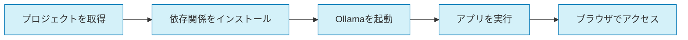

# Ollama MCP Client & Agent with Agno


MCPサーバーと連携するAgnoベースのクライアント・エージェントフレームワークです。新規または既存のMCPサーバーとシームレスに接続し、マルチモーダル対応のデバッグ機能とエージェント拡張が可能なインターフェースを提供します。

## 主要機能

- 🔌 **MCPサーバー連携**: 標準MCPプロトコルに準拠した通信
- 🧠 **マルチモーダル対応**: テキスト、画像、音声、動画を扱うエージェントを構築可能
- 🚀 **高速なエージェント実行**: Agnoフレームワークによる最適化された実行エンジン
- 🔍 **包括的デバッグ機能**: 連携問題をリアルタイムに特定・解決
- 🧩 **拡張可能なエージェント**: カスタムツールやプラグインを追加可能
- 🖥️ **Gradioウェブインターフェース**: 直感的なUIで開発と利用を効率化
- 📊 **パフォーマンスモニタリング**: エージェントのセッションとパフォーマンスをリアルタイムで監視

## Agnoフレームワークについて

このプロジェクトは[Agno](https://github.com/agno-agi/agno)フレームワークを採用しています。Agnoは以下の特徴を持つ軽量なマルチモーダルエージェントフレームワークです：

- **モデル非依存**: 任意のモデルやプロバイダーと連携可能
- **マルチモーダル**: テキスト、画像、音声、動画のネイティブサポート
- **マルチエージェント**: 専門化されたエージェントチームの構築
- **メモリ管理**: エージェントセッションと状態のデータベース保存
- **知識ベース**: RAGや動的few-shotのためのベクトルデータベース
- **構造化出力**: エージェントから構造化データでレスポンスを取得

## クイックスタート



### インストール手順

```bash
# リポジトリをクローン
git clone https://github.com/yourusername/ollama-mcp-client.git
cd ollama-mcp-client

# poetryをインストール（まだの場合）
curl -sSL https://install.python-poetry.org | python3 -

# 仮想環境を作成して依存関係をインストール
poetry install

# 開発用依存関係もインストールする場合
poetry install --with dev

# 仮想環境を有効化
poetry shell

# Ollamaが起動していることを確認

# アプリケーションを実行
poetry run app
```

その後、ブラウザで `http://localhost:7860` にアクセスしてください。

## その他のドキュメント

詳細については、以下のドキュメントを参照してください：

- [アーキテクチャ概要](docs/ARCHITECTURE.md)
- [開発環境のセットアップ](docs/DEVELOPMENT_SETUP.md)
- [コントリビューションガイド](docs/CONTRIBUTING.md)
- [API ドキュメント](docs/API_DOCUMENTATION.md)
- [製品要件定義](docs/PRD.md)
- [Agno統合ガイド](docs/AGNO_INTEGRATION.md)

## ライセンス

このプロジェクトは [MIT ライセンス](LICENSE) の下で公開されています。