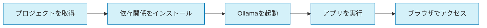

# Ollama MCP Client & Agent


MCPサーバーと連携するOllamaベースのクライアント・エージェントフレームワークです。新規または既存のMCPサーバーとシームレスに接続し、デバッグ機能とエージェント拡張が可能なインターフェースを提供します。

## 主要機能

- 🔌 **MCPサーバー連携**: 標準MCPプロトコルに準拠した通信
- 🧠 **複数Ollamaモデル対応**: さまざまなLLMを切り替えながら利用可能
- 🔍 **包括的デバッグ機能**: 連携問題をリアルタイムに特定・解決
- 🧩 **拡張可能なエージェント**: カスタムツールやプラグインを追加可能
- 🖥️ **Gradioウェブインターフェース**: 直感的なUIで開発と利用を効率化

## クイックスタート



### インストール手順

```bash
# リポジトリをクローン
git clone https://github.com/yourusername/ollama-mcp-client.git
cd ollama-mcp-client

# 仮想環境を作成して有効化
uv venv
source .venv/bin/activate  # Unix/MacOS
# または
.venv\Scripts\activate  # Windows

# 依存関係をインストール
uv pip install -r requirements.txt

# Ollamaが起動していることを確認

# アプリケーションを実行
uv run app.py
```

その後、ブラウザで `http://localhost:7860` にアクセスしてください。

## その他のドキュメント

詳細については、以下のドキュメントを参照してください：

- [アーキテクチャ概要](docs/ARCHITECTURE.md)
- [開発環境のセットアップ](docs/DEVELOPMENT_SETUP.md)
- [コントリビューションガイド](docs/CONTRIBUTING.md)
- [API ドキュメント](docs/API_DOCUMENTATION.md)
- [製品要件定義](docs/PRD.md)

## ライセンス

このプロジェクトは [MIT ライセンス](LICENSE) の下で公開されています。