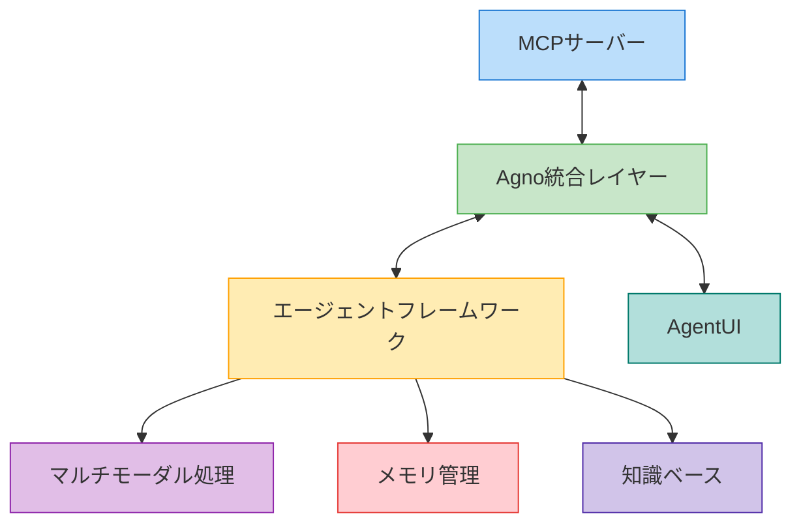

# Agno統合ガイド

このガイドでは、MCPサーバーとAgnoフレームワークを統合する方法について説明します。

## 目次

1. [概要](#概要)
2. [アーキテクチャ](#アーキテクチャ)
3. [セットアップ手順](#セットアップ手順)
4. [基本的な使用方法](#基本的な使用方法)
5. [高度な機能](#高度な機能)
6. [トラブルシューティング](#トラブルシューティング)

## 概要

Agnoフレームワークは、マルチモーダルAIエージェントを構築するための軽量なライブラリです。MCPサーバーとの統合により、以下の機能が利用可能になります：

- マルチモーダルエージェントの構築と実行
- 高速なエージェント処理
- 柔軟なモデル選択
- メモリと知識の管理
- パフォーマンスモニタリング

## アーキテクチャ



## セットアップ手順

1. 依存関係のインストール

```bash
# poetryを使用してAgnoと関連パッケージをインストール
poetry install

# または直接pipを使用
pip install -e .
```

2. 環境変数の設定

```bash
# 必要に応じて.envファイルに追加
AGNO_TELEMETRY=false  # テレメトリを無効化する場合
```

## 基本的な使用方法

### アプリケーション起動方法

OllamaMCPアプリケーションを起動するには、以下のコマンドを使用します：

```bash
# コマンドラインから起動する場合（最も簡単な方法）
poetry run app

# サーバーパスを指定して起動
poetry run app --server path/to/mcp_server.py

# モデルを指定して起動
poetry run app --model llama3

# デバッグレベルを指定して起動
poetry run app --debug debug

# UIポートを指定して起動
poetry run app --port 8080

# 共有リンクを生成して起動
poetry run app --share

# すべてのオプションを組み合わせて起動
poetry run app --model llama3 --server path/to/mcp_server.py --debug debug --port 8080 --share

# または、エントリーポイントスクリプトを直接実行することも可能です
python -m ollama_mcp.app
```

### プログラムからの使用

プログラムから直接OllamaMCPを使用するには、以下のようにします：

```python
from ollama_mcp.app import OllamaMCPApp

# アプリケーションのインスタンス化
app = OllamaMCPApp(model_name="llama3", debug_level="info")

# アプリケーションの実行
app.run(server_path="path/to/mcp_server.py", port=7860)
```

### MCPサーバーとの接続

MCPサーバーに接続するには、以下のようにします：

```python
import asyncio
from ollama_mcp.agno_integration import OllamaMCPIntegration

async def connect_example():
    # クライアントの初期化
    client = OllamaMCPIntegration(model_name="llama3")
    
    # サーバーに接続
    tools = await client.connect_to_server("path/to/mcp_server.py")
    
    # クエリの処理
    response = await client.process_query("Hello, how are you?")
    print(response)
    
    # マルチモーダルクエリの処理
    response = await client.process_multimodal_query(
        "What's in this image?", 
        ["path/to/image.jpg"]
    )
    print(response)
    
    # 接続の終了
    await client.close()

# 非同期関数の実行
asyncio.run(connect_example())
```

## 高度な機能

### マルチモーダル機能の使用

```python
from ollama_mcp.agno_multimodal import AgnoMultimodalIntegration

# マルチモーダルプロセッサーの初期化
processor = AgnoMultimodalIntegration(model_name="llama3")

# 画像処理の例
async def process_image_example():
    await processor.setup_agent()
    result = await processor.process_with_images(
        "What's in this image?",
        ["path/to/image.jpg"]
    )
    print(result)

# 音声処理の例
async def process_audio_example():
    await processor.setup_agent()
    result = await processor.process_with_audio(
        "Transcribe this audio",
        "path/to/audio.mp3"
    )
    print(result)
```

### デバッグ機能の使用

```python
from ollama_mcp.debug_module import AgnoMCPDebugger

# デバッガーの初期化
debugger = AgnoMCPDebugger(level="debug")

# ログの記録
debugger.log("テストメッセージ", "info")

# ツールコールの記録
debugger.record_tool_call("test_tool", {"arg": "value"}, "result", 0.1)

# エラーの記録
debugger.record_error("connection_error", "Failed to connect")

# ログの取得
logs = debugger.get_recent_logs(10)
```

## トラブルシューティング

### 一般的な問題と解決策

1. **接続エラー**
   - MCPサーバーの状態を確認
   - ネットワーク設定を確認
   - ログレベルを DEBUG に設定して詳細を確認

2. **メモリ使用量の問題**
   - メモリキャッシュのクリア
   - バッチサイズの調整
   - 不要なセッションの終了

3. **パフォーマンスの問題**
   - モデルパラメータの最適化
   - キャッシュ戦略の見直し
   - 並列処理の活用

### デバッグ方法

```python
import logging

# ログレベルの設定
logging.basicConfig(level=logging.DEBUG)

# デバッグモードでアプリを起動
app = OllamaMCPApp(debug_level="debug")
app.run()
```

## 参考リンク

- [Agno公式ドキュメント](https://docs.agno.com)
- [MCPプロトコル仕様](https://mcp-protocol.org) 