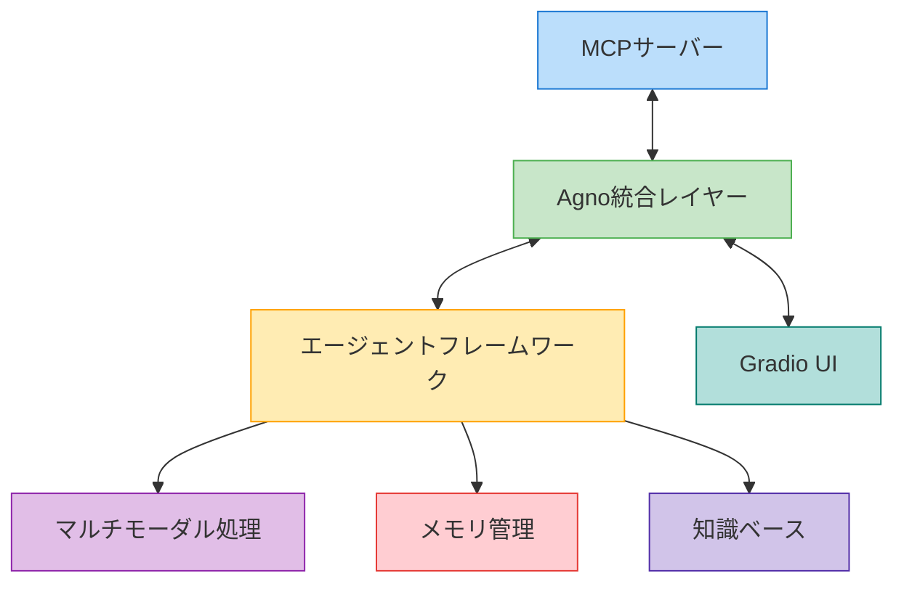

# Agno統合ガイド

このガイドでは、MCPサーバーとAgnoフレームワークを統合する方法について説明します。

## 目次

1. [概要](#概要)
2. [アーキテクチャ](#アーキテクチャ)
3. [セットアップ手順](#セットアップ手順)
4. [基本的な使用方法](#基本的な使用方法)
5. [高度な機能](#高度な機能)
6. [トラブルシューティング](#トラブルシューティング)

## 概要

Agnoフレームワークは、マルチモーダルAIエージェントを構築するための軽量なライブラリです。MCPサーバーとの統合により、以下の機能が利用可能になります：

- マルチモーダルエージェントの構築と実行
- 高速なエージェント処理
- 柔軟なモデル選択
- メモリと知識の管理
- パフォーマンスモニタリング

## アーキテクチャ



## セットアップ手順

1. 依存関係のインストール

```bash
# poetryを使用してAgnoと関連パッケージをインストール
poetry add agno mcp gradio loguru

# または直接pipを使用
pip install agno mcp gradio loguru
```

2. 環境変数の設定

```bash
# 必要に応じて.envファイルに追加
AGNO_TELEMETRY=false  # テレメトリを無効化する場合
```

3. プロジェクト構造の更新

```
ollama_mcp/
├── __init__.py
├── agno_integration.py      # Agno統合モジュール
├── agno_multimodal.py      # マルチモーダル機能
├── debug.py                # デバッグモジュール
├── ui/                     # UIコンポーネント
└── utils/                  # ユーティリティ
```

## 基本的な使用方法

### 1. エージェントの作成

```python
from agno.agent import Agent
from agno.models.openai import OpenAIChat
from mcp.tools import MCPTools

# MCPツールを使用するエージェントを作成
agent = Agent(
    model=OpenAIChat(id="gpt-4"),
    tools=[MCPTools()],
    markdown=True
)
```

### 2. MCPサーバーとの接続

```python
from ollama_mcp.agno_integration import MCPAgnoClient

# クライアントの初期化
client = MCPAgnoClient(agent=agent)

# サーバーに接続
await client.connect_to_server("path/to/mcp_server.py")
```

### 3. マルチモーダル機能の使用

```python
from ollama_mcp.agno_multimodal import process_image, process_audio

# 画像処理
image_result = await agent.process_image("path/to/image.jpg")

# 音声処理
audio_result = await agent.process_audio("path/to/audio.mp3")
```

## 高度な機能

### 1. メモリ管理

```python
from agno.memory import AgentMemory

# メモリの初期化
memory = AgentMemory()
agent.set_memory(memory)

# コンテキストの保存
await memory.store("key", "value")

# コンテキストの取得
value = await memory.retrieve("key")
```

### 2. 知識ベースの統合

```python
from agno.knowledge import VectorStore

# ベクトルストアの初期化
vector_store = VectorStore()
agent.set_knowledge_base(vector_store)

# ドキュメントの追加
await vector_store.add_document("path/to/doc.pdf")

# 関連情報の検索
results = await vector_store.search("query")
```

### 3. パフォーマンスモニタリング

```python
from agno.monitoring import Monitor

# モニタリングの設定
monitor = Monitor()
agent.set_monitor(monitor)

# パフォーマンス指標の取得
metrics = await monitor.get_metrics()
```

## トラブルシューティング

### 一般的な問題と解決策

1. **接続エラー**
   - MCPサーバーの状態を確認
   - ネットワーク設定を確認
   - ログレベルを DEBUG に設定して詳細を確認

2. **メモリ使用量の問題**
   - メモリキャッシュのクリア
   - バッチサイズの調整
   - 不要なセッションの終了

3. **パフォーマンスの問題**
   - モデルパラメータの最適化
   - キャッシュ戦略の見直し
   - 並列処理の活用

### デバッグ方法

```python
import loguru

# ログレベルの設定
loguru.logger.level("DEBUG")

# 詳細なログ出力の有効化
agent.enable_debug_logging()

# パフォーマンスプロファイリング
with agent.profile() as profiler:
    result = await agent.process_query("test query")
    
print(profiler.summary())
```

## 参考リンク

- [Agno公式ドキュメント](https://docs.agno.com)
- [MCPプロトコル仕様](https://mcp-protocol.org)
- [Gradioドキュメント](https://gradio.app/docs) 