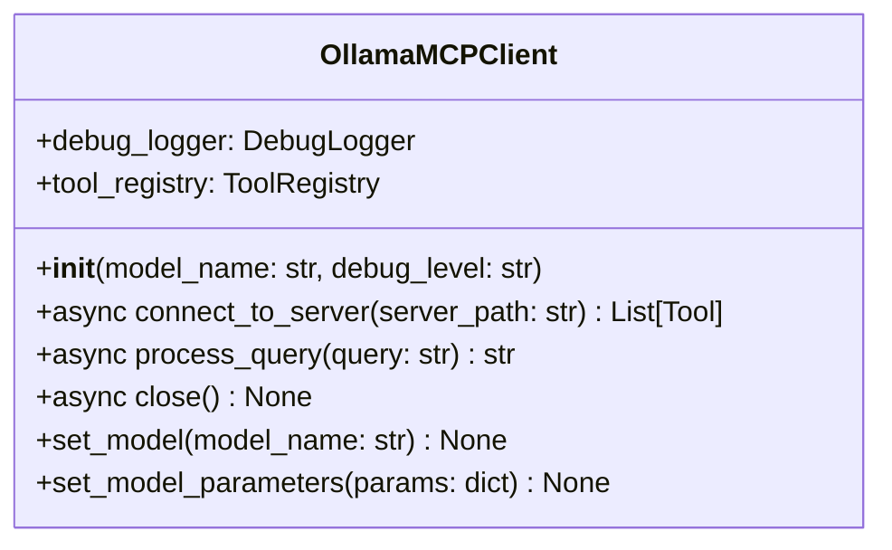
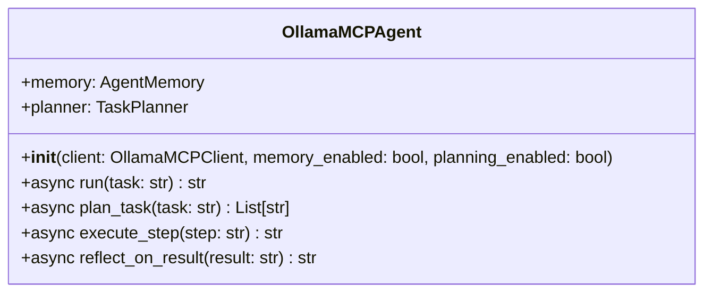
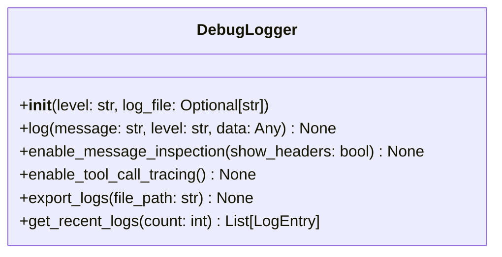
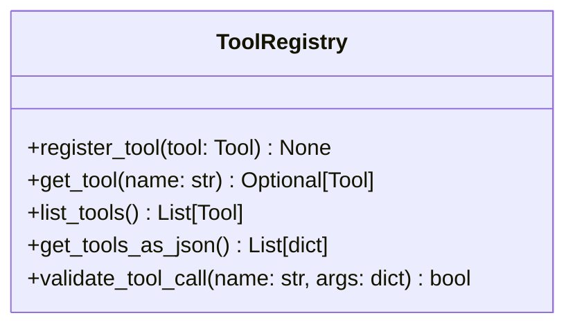
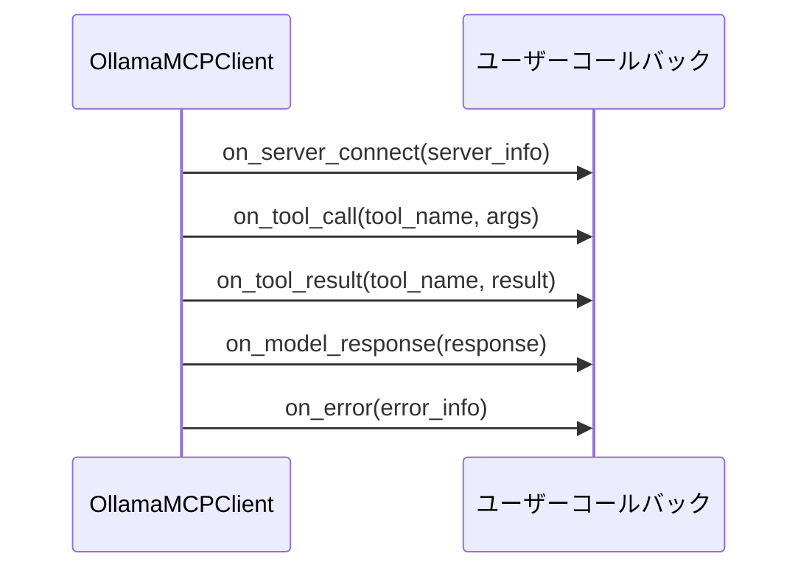
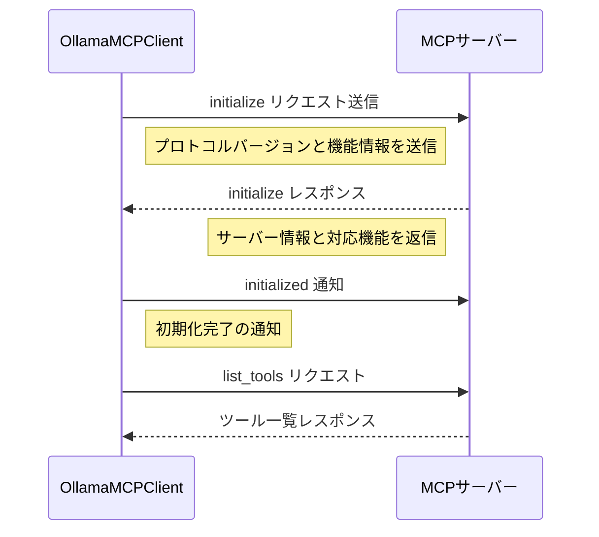

# API ドキュメント

このドキュメントでは、Ollama MCP Client & Agent の主要な API とその使用方法について説明します。

## API 設計原則

Ollama MCP Client & Agent の API は、以下の原則に基づいて設計されています：

1. **一貫性**: 関連する操作は一貫したパターンに従い、予測可能
2. **明確性**: 関数名と引数が自己説明的で目的が明確
3. **非同期処理**: インタラクションは非同期 (async/await) を基本とする
4. **型安全性**: 型ヒントを使用して API の意図を明確にする
5. **エラー処理**: 適切な例外と詳細なエラー情報を提供

## 主要コンポーネント API

### OllamaMCPClient

MCPサーバーと連携するためのクライアントクラスです。



#### 主要メソッド

```python
# クライアントの初期化
client = OllamaMCPClient(model_name="llama3", debug_level="info")

# サーバーへの接続
tools = await client.connect_to_server("path/to/mcp_server.py")

# クエリの処理
response = await client.process_query("天気予報を教えてください")

# モデルとパラメータの設定
client.set_model("mistral")
client.set_model_parameters({"temperature": 0.7, "top_p": 0.9})

# 接続の終了
await client.close()
```

### OllamaMCPAgent

OllamaMCPClient の機能を拡張し、より高度なエージェント機能を提供します。



#### 主要メソッド

```python
# エージェントの初期化
agent = OllamaMCPAgent(
    client=client,
    memory_enabled=True,
    planning_enabled=True
)

# タスクの実行
result = await agent.run("複数のステップを必要とするタスク")

# タスクの計画のみを取得
steps = await agent.plan_task("複雑なタスク")

# 特定のステップを実行
step_result = await agent.execute_step("特定のサブタスク")
```

### DebugLogger

詳細なデバッグ情報を記録および表示するためのユーティリティクラスです。



#### 主要メソッド

```python
# デバッグロガーの直接使用
logger = DebugLogger(level="debug", log_file="debug.log")
logger.log("テスト接続", level="info", data={"server": "test_server"})

# メッセージ検査の有効化
client.debug_logger.enable_message_inspection(show_headers=True)

# ツールコールトレースの有効化
client.debug_logger.enable_tool_call_tracing()

# ログのエクスポート
client.debug_logger.export_logs("detailed_logs.json")
```

### ToolRegistry

ツールの登録、管理、検証を行うクラスです。



#### 主要メソッド

```python
# ツールの手動登録
registry = ToolRegistry()
registry.register_tool(weather_tool)

# 利用可能なツールの一覧取得
tools = client.tool_registry.list_tools()

# ツールのJSON形式での取得
tools_json = client.tool_registry.get_tools_as_json()
```

## ツール定義と実装

### @Tool デコレータ

カスタムツールの定義を簡素化するデコレータです。

```python
from ollama_mcp import Tool

@Tool.register(
    name="weather",
    description="Get weather information for a location",
    input_schema={
        "type": "object",
        "properties": {
            "location": {"type": "string", "description": "City name or location"}
        },
        "required": ["location"]
    }
)
async def get_weather(location: str) -> dict:
    """場所の天気情報を取得する"""
    # 実装...
    return {"temperature": 25, "condition": "sunny"}
```

## イベントとコールバック



### コールバックの登録例

```python
# コールバック関数の定義
async def on_tool_call(tool_name, args):
    print(f"ツール呼び出し: {tool_name} {args}")

# コールバックの登録
client.on("tool_call", on_tool_call)

# または装飾子を使用
@client.on("tool_result")
async def handle_tool_result(tool_name, result):
    print(f"ツール結果: {tool_name} {result}")
```

## 一般的なエラーコード

| エラーコード | 説明 | 対処法 |
|--------------|------|--------|
| `CONNECTION_ERROR` | MCPサーバーへの接続に失敗 | サーバーパスと実行状態を確認 |
| `PROTOCOL_ERROR` | MCPプロトコルエラー | MCPプロトコルバージョンの互換性を確認 |
| `TOOL_NOT_FOUND` | 指定されたツールが見つからない | ツール名の綴りとサーバー登録を確認 |
| `TOOL_EXECUTION_ERROR` | ツール実行中にエラーが発生 | ツールの実装とエラーログを確認 |
| `MODEL_ERROR` | Ollamaモデルでエラーが発生 | モデル名とパラメータを確認 |
| `INVALID_ARGUMENTS` | ツールに無効な引数が渡された | 引数の型とスキーマを確認 |

## リクエスト/レスポンス例

### クエリ処理の例

```python
# リクエスト
response = await client.process_query("東京の天気を教えてください")

# レスポンス
"""
東京の現在の天気は晴れで、気温は25°Cです。
湿度は60%で、風速は3m/sです。
今日の最高気温は28°C、最低気温は18°Cの予報です。
"""
```

### ツールコールの例

```python
# 内部的なツールコール（自動的に処理される）
tool_call = {
    "name": "weather",
    "arguments": {
        "location": "東京"
    }
}

# ツール実行結果
tool_result = {
    "temperature": 25,
    "condition": "sunny",
    "humidity": 60,
    "wind_speed": 3,
    "high": 28,
    "low": 18
}
```

## 認証フロー

MCP サーバーとの接続認証フローは以下の通りです：



## API エンドポイント関係

```mermaid
graph LR
    A[OllamaMCPClient] --> B[connect_to_server]
    A --> C[process_query]
    A --> D[close]
    
    C --> E[Ollama API]
    C --> F[ツール実行]