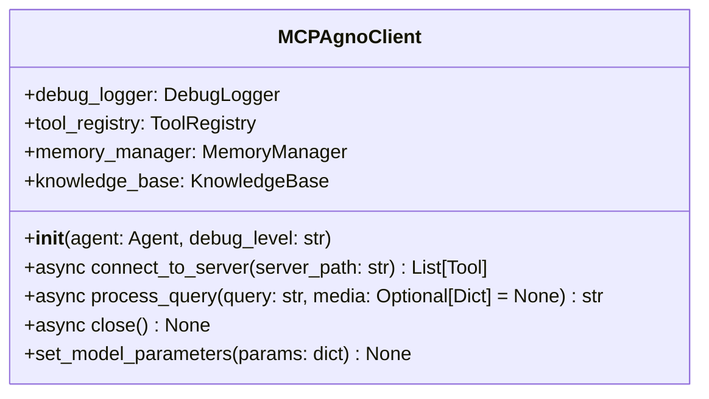
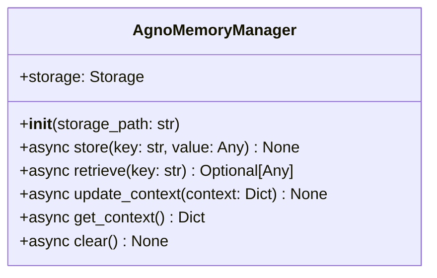
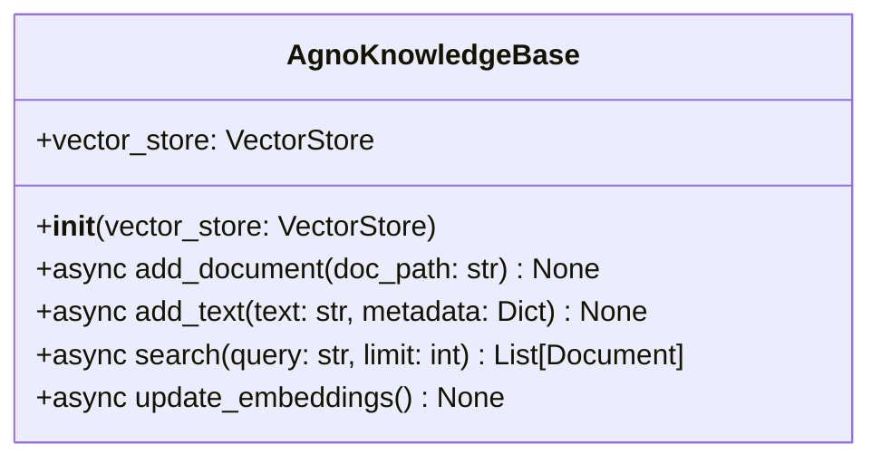
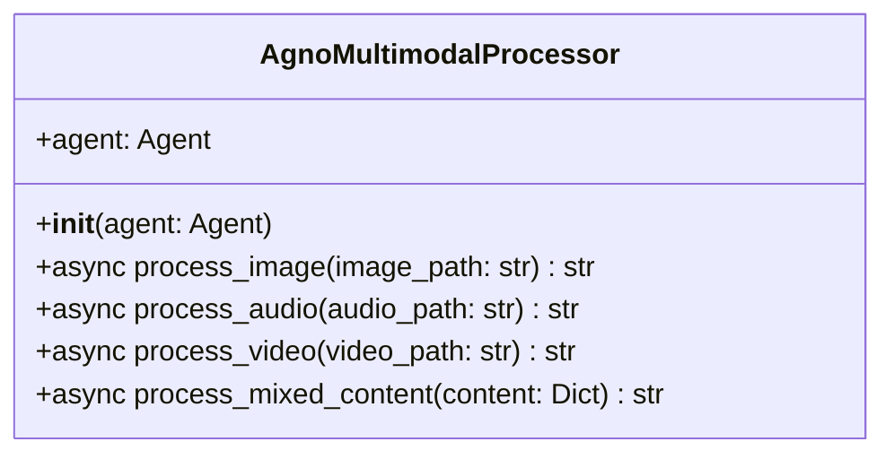
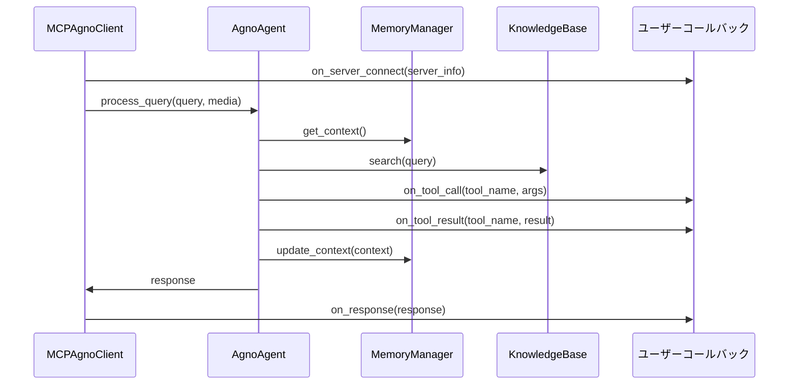

# API ドキュメント

このドキュメントでは、Ollama MCP Client & Agent の主要な API とその使用方法について説明します。

## API 設計原則

Ollama MCP Client & Agent の API は、以下の原則に基づいて設計されています：

1. **一貫性**: 関連する操作は一貫したパターンに従い、予測可能
2. **明確性**: 関数名と引数が自己説明的で目的が明確
3. **非同期処理**: インタラクションは非同期 (async/await) を基本とする
4. **型安全性**: 型ヒントを使用して API の意図を明確にする
5. **エラー処理**: 適切な例外と詳細なエラー情報を提供
6. **マルチモーダル**: 各種メディアタイプの統合的な処理をサポート

## 主要コンポーネント API

### MCPAgnoClient

MCPサーバーとAgnoエージェントを統合するクライアントクラスです。



#### 主要メソッド

```python
from agno.agent import Agent
from agno.models.openai import OpenAIChat
from ollama_mcp.agno_integration import MCPAgnoClient

# エージェントの作成
agent = Agent(
    model=OpenAIChat(id="gpt-4"),
    description="マルチモーダル対応のエージェント",
    markdown=True
)

# クライアントの初期化
client = MCPAgnoClient(agent=agent, debug_level="info")

# サーバーへの接続
tools = await client.connect_to_server("path/to/mcp_server.py")

# テキストクエリの処理
response = await client.process_query("天気予報を教えてください")

# マルチモーダルクエリの処理
response = await client.process_query(
    "この画像について説明してください",
    media={"image": "path/to/image.jpg"}
)

# 接続の終了
await client.close()
```

### AgnoMemoryManager

エージェントのメモリと状態を管理するクラスです。



#### 主要メソッド

```python
from ollama_mcp.memory import AgnoMemoryManager

# メモリマネージャーの初期化
memory = AgnoMemoryManager("path/to/storage")

# コンテキストの保存
await memory.store("user_preference", {"language": "ja"})

# コンテキストの取得
context = await memory.get_context()

# コンテキストの更新
await memory.update_context({"last_query": "天気予報"})

# メモリのクリア
await memory.clear()
```

### AgnoKnowledgeBase

エージェントの知識ベースを管理するクラスです。



#### 主要メソッド

```python
from ollama_mcp.knowledge import AgnoKnowledgeBase
from agno.vector_store import VectorStore

# 知識ベースの初期化
vector_store = VectorStore()
knowledge_base = AgnoKnowledgeBase(vector_store)

# ドキュメントの追加
await knowledge_base.add_document("path/to/document.pdf")

# テキストの追加
await knowledge_base.add_text(
    "重要な情報",
    metadata={"source": "manual", "date": "2025-03-22"}
)

# 情報の検索
results = await knowledge_base.search("検索クエリ", limit=5)
```

### AgnoMultimodalProcessor

マルチモーダルコンテンツを処理するクラスです。



#### 主要メソッド

```python
from ollama_mcp.agno_multimodal import AgnoMultimodalProcessor

# プロセッサーの初期化
processor = AgnoMultimodalProcessor(agent)

# 画像の処理
image_description = await processor.process_image("path/to/image.jpg")

# 音声の処理
audio_transcript = await processor.process_audio("path/to/audio.mp3")

# 動画の処理
video_analysis = await processor.process_video("path/to/video.mp4")

# 複合コンテンツの処理
result = await processor.process_mixed_content({
    "text": "説明文",
    "image": "path/to/image.jpg",
    "audio": "path/to/audio.mp3"
})
```

## イベントとコールバック



### コールバックの登録例

```python
# コールバック関数の定義
async def on_tool_call(tool_name, args):
    print(f"ツール呼び出し: {tool_name} {args}")

# コールバックの登録
client.on("tool_call", on_tool_call)

# または装飾子を使用
@client.on("response")
async def handle_response(response):
    print(f"エージェントの応答: {response}")
```

## 一般的なエラーコード

| エラーコード | 説明 | 対処法 |
|--------------|------|--------|
| `CONNECTION_ERROR` | MCPサーバーへの接続に失敗 | サーバーパスと実行状態を確認 |
| `PROTOCOL_ERROR` | MCPプロトコルエラー | MCPプロトコルバージョンの互換性を確認 |
| `TOOL_NOT_FOUND` | 指定されたツールが見つからない | ツール名の綴りとサーバー登録を確認 |
| `TOOL_EXECUTION_ERROR` | ツール実行中にエラーが発生 | ツールの実装とエラーログを確認 |
| `AGENT_ERROR` | エージェントでエラーが発生 | エージェントの設定とログを確認 |
| `MEMORY_ERROR` | メモリ操作でエラーが発生 | ストレージパスと権限を確認 |
| `KNOWLEDGE_ERROR` | 知識ベース操作でエラーが発生 | ベクトルストアの状態を確認 |
| `MEDIA_ERROR` | メディア処理でエラーが発生 | ファイル形式とパスを確認 |
| `INVALID_ARGUMENTS` | 無効な引数が渡された | 引数の型とスキーマを確認 |

## リクエスト/レスポンス例

### テキストクエリの例

```python
# リクエスト
response = await client.process_query("東京の天気を教えてください")

# レスポンス
"""
東京の現在の天気は晴れで、気温は25°Cです。
湿度は60%で、風速は3m/sです。
今日の最高気温は28°C、最低気温は18°Cの予報です。
"""
```

### マルチモーダルクエリの例

```python
# リクエスト
response = await client.process_query(
    "この画像の天気状況を分析してください",
    media={"image": "path/to/weather_image.jpg"}
)

# レスポンス
"""
画像から、以下の天気状況が観察されます：
- 曇り空で、層積雲が見られます
- 視界は良好で、降水の兆候はありません
- 風は弱く、木々の揺れはわずかです
- 気温は穏やかそうで、春または秋の典型的な天気のように見えます
"""
```

## API エンドポイント関係

```mermaid
graph LR
    A[MCPAgnoClient] --> B[connect_to_server]
    A --> C[process_query]
    A --> D[close]
    
    C --> E[AgnoAgent]
    C --> F[MemoryManager]
    C --> G[KnowledgeBase]
    C --> H[MultimodalProcessor]
    
    E --> I[ツール実行]
    F --> J[コンテキスト管理]
    G --> K[知識検索]
    H --> L[メディア処理]