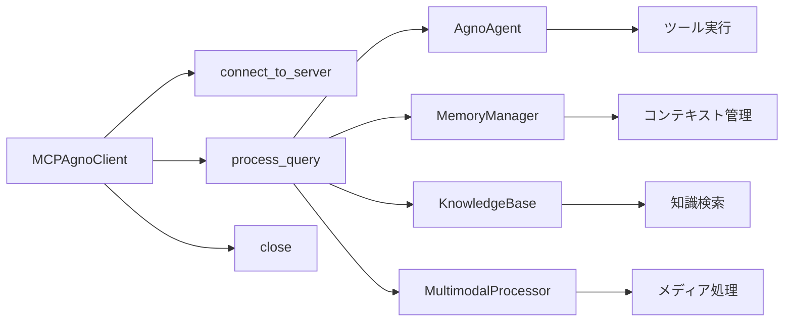

# API ドキュメント

このドキュメントでは、Ollama MCP Client & Agent の主要な API とその使用方法について説明します。

## API 設計原則

Ollama MCP Client & Agent の API は、以下の原則に基づいて設計されています：

1. **一貫性**: 関連する操作は一貫したパターンに従い、予測可能
2. **明確性**: 関数名と引数が自己説明的で目的が明確
3. **非同期処理**: インタラクションは非同期 (async/await) を基本とする
4. **型安全性**: 型ヒントを使用して API の意図を明確にする
5. **エラー処理**: 適切な例外と詳細なエラー情報を提供
6. **マルチモーダル**: 各種メディアタイプの統合的な処理をサポート

## 主要コンポーネント API

### MCPAgnoClient

MCPサーバーとAgnoエージェントを統合するクライアントクラスです。


#### 主要メソッド

```python
from agno.agent import Agent
from agno.models.openai import OpenAIChat
from ollama_mcp.agno_integration import MCPAgnoClient

# エージェントの作成
agent = Agent(
    model=OpenAIChat(id="gpt-4"),
    description="マルチモーダル対応のエージェント",
    markdown=True
)

# クライアントの初期化
client = MCPAgnoClient(agent=agent, debug_level="info")

# サーバーへの接続
tools = await client.connect_to_server("path/to/mcp_server.py")

# テキストクエリの処理
response = await client.process_query("天気予報を教えてください")

# マルチモーダルクエリの処理
response = await client.process_query(
    "この画像について説明してください",
    media={"image": "path/to/image.jpg"}
)

# 接続の終了
await client.close()
```

### AgnoMemoryManager

エージェントのメモリと状態を管理するクラスです。


#### 主要メソッド

```python
from ollama_mcp.memory import AgnoMemoryManager

# メモリマネージャーの初期化
memory = AgnoMemoryManager("path/to/storage")

# コンテキストの保存
await memory.store("user_preference", {"language": "ja"})

# コンテキストの取得
context = await memory.get_context()

# コンテキストの更新
await memory.update_context({"last_query": "天気予報"})

# メモリのクリア
await memory.clear()
```

### AgnoKnowledgeBase

エージェントの知識ベースを管理するクラスです。


#### 主要メソッド

```python
from ollama_mcp.knowledge import AgnoKnowledgeBase
from agno.vector_store import VectorStore

# 知識ベースの初期化
vector_store = VectorStore()
knowledge_base = AgnoKnowledgeBase(vector_store)

# ドキュメントの追加
await knowledge_base.add_document("path/to/document.pdf")

# テキストの追加
await knowledge_base.add_text(
    "重要な情報",
    metadata={"source": "manual", "date": "2025-03-22"}
)

# 情報の検索
results = await knowledge_base.search("検索クエリ", limit=5)
```

### AgnoMultimodalProcessor

マルチモーダルコンテンツを処理するクラスです。


#### 主要メソッド

```python
from ollama_mcp.agno_multimodal import AgnoMultimodalProcessor

# プロセッサーの初期化
processor = AgnoMultimodalProcessor(agent)

# 画像の処理
image_description = await processor.process_image("path/to/image.jpg")

# 音声の処理
audio_transcript = await processor.process_audio("path/to/audio.mp3")

# 動画の処理
video_analysis = await processor.process_video("path/to/video.mp4")

# 複合コンテンツの処理
result = await processor.process_mixed_content({
    "text": "説明文",
    "image": "path/to/image.jpg",
    "audio": "path/to/audio.mp3"
})
```

## イベントとコールバック


### コールバックの登録例

```python
# コールバック関数の定義
async def on_tool_call(tool_name, args):
    print(f"ツール呼び出し: {tool_name} {args}")

# コールバックの登録
client.on("tool_call", on_tool_call)

# または装飾子を使用
@client.on("response")
async def handle_response(response):
    print(f"エージェントの応答: {response}")
```

## 一般的なエラーコード

| エラーコード | 説明 | 対処法 |
|--------------|------|--------|
| `CONNECTION_ERROR` | MCPサーバーへの接続に失敗 | サーバーパスと実行状態を確認 |
| `PROTOCOL_ERROR` | MCPプロトコルエラー | MCPプロトコルバージョンの互換性を確認 |
| `TOOL_NOT_FOUND` | 指定されたツールが見つからない | ツール名の綴りとサーバー登録を確認 |
| `TOOL_EXECUTION_ERROR` | ツール実行中にエラーが発生 | ツールの実装とエラーログを確認 |
| `AGENT_ERROR` | エージェントでエラーが発生 | エージェントの設定とログを確認 |
| `MEMORY_ERROR` | メモリ操作でエラーが発生 | ストレージパスと権限を確認 |
| `KNOWLEDGE_ERROR` | 知識ベース操作でエラーが発生 | ベクトルストアの状態を確認 |
| `MEDIA_ERROR` | メディア処理でエラーが発生 | ファイル形式とパスを確認 |
| `INVALID_ARGUMENTS` | 無効な引数が渡された | 引数の型とスキーマを確認 |

## リクエスト/レスポンス例

### テキストクエリの例

```python
# リクエスト
response = await client.process_query("東京の天気を教えてください")

# レスポンス
"""
東京の現在の天気は晴れで、気温は25°Cです。
湿度は60%で、風速は3m/sです。
今日の最高気温は28°C、最低気温は18°Cの予報です。
"""
```

### マルチモーダルクエリの例

```python
# リクエスト
response = await client.process_query(
    "この画像の天気状況を分析してください",
    media={"image": "path/to/weather_image.jpg"}
)

# レスポンス
"""
画像から、以下の天気状況が観察されます：
- 曇り空で、層積雲が見られます
- 視界は良好で、降水の兆候はありません
- 風は弱く、木々の揺れはわずかです
- 気温は穏やかそうで、春または秋の典型的な天気のように見えます
"""
```

## API エンドポイント関係



## MCPサーバー情報可視化API

### 1. サーバー状態API

#### 1.1 基本状態の取得

```typescript
GET /api/mcp/status

Response {
    status: "connected" | "disconnected" | "error",
    uptime: number,  // 秒単位
    activeConnections: number,
    toolCount: number,
    lastUpdated: string  // ISO 8601形式
}
```

#### 1.2 詳細情報の取得

```typescript
GET /api/mcp/info

Response {
    version: string,
    serverType: string,
    supportedProtocols: string[],
    capabilities: {
        multimodal: boolean,
        streaming: boolean,
        batchProcessing: boolean
    },
    configuration: {
        maxConnections: number,
        timeoutSeconds: number,
        maxRequestSize: number
    }
}
```

### 2. メトリクスAPI

#### 2.1 リアルタイムメトリクスの取得

```typescript
GET /api/mcp/metrics/realtime

Response {
    timestamp: string,  // ISO 8601形式
    metrics: {
        requestsPerMinute: number,
        averageResponseTime: number,  // ミリ秒
        errorRate: number,  // パーセント
        cpuUsage: number,  // パーセント
        memoryUsage: number,  // バイト
        diskIO: {
            read: number,  // バイト/秒
            write: number  // バイト/秒
        }
    }
}
```

#### 2.2 履歴メトリクスの取得

```typescript
GET /api/mcp/metrics/history
Query Parameters {
    startTime: string,  // ISO 8601形式
    endTime: string,    // ISO 8601形式
    resolution: "1m" | "5m" | "1h" | "1d"
}

Response {
    timeRange: {
        start: string,
        end: string
    },
    dataPoints: Array<{
        timestamp: string,
        metrics: {
            requestsPerMinute: number,
            averageResponseTime: number,
            errorRate: number,
            cpuUsage: number,
            memoryUsage: number
        }
    }>
}
```

### 3. ツール使用状況API

#### 3.1 ツール使用統計の取得

```typescript
GET /api/mcp/tools/stats
Query Parameters {
    timeRange: "1h" | "24h" | "7d" | "30d",
    category?: string
}

Response {
    summary: {
        totalCalls: number,
        uniqueTools: number,
        averageSuccessRate: number
    },
    toolStats: Array<{
        toolName: string,
        category: string,
        calls: number,
        successRate: number,
        averageExecutionTime: number,
        lastUsed: string
    }>
}
```

#### 3.2 ツール詳細情報の取得

```typescript
GET /api/mcp/tools/{toolName}/details

Response {
    name: string,
    description: string,
    schema: object,
    stats: {
        totalCalls: number,
        successRate: number,
        averageExecutionTime: number,
        errorTypes: Array<{
            type: string,
            count: number
        }>,
        usageHistory: Array<{
            timestamp: string,
            success: boolean,
            executionTime: number
        }>
    }
}
```

### 4. エラー分析API

#### 4.1 エラーサマリーの取得

```typescript
GET /api/mcp/errors/summary
Query Parameters {
    timeRange: "1h" | "24h" | "7d" | "30d"
}

Response {
    totalErrors: number,
    errorRate: number,
    topErrors: Array<{
        type: string,
        count: number,
        percentage: number
    }>,
    trends: {
        hourly: Array<{
            hour: string,
            count: number
        }>,
        daily: Array<{
            date: string,
            count: number
        }>
    }
}
```

#### 4.2 エラー詳細の取得

```typescript
GET /api/mcp/errors/details
Query Parameters {
    errorType?: string,
    startTime: string,
    endTime: string,
    limit: number,
    offset: number
}

Response {
    total: number,
    errors: Array<{
        id: string,
        timestamp: string,
        type: string,
        message: string,
        stackTrace: string,
        context: {
            toolName?: string,
            requestId?: string,
            userId?: string
        },
        status: "new" | "investigating" | "resolved"
    }>
}
```

### 5. アラート設定API

#### 5.1 アラートルールの取得

```typescript
GET /api/mcp/alerts/rules

Response {
    rules: Array<{
        id: string,
        name: string,
        condition: {
            metric: string,
            operator: ">" | "<" | "==" | ">=",
            threshold: number
        },
        actions: Array<{
            type: "email" | "webhook" | "notification",
            config: object
        }>,
        enabled: boolean
    }>
}
```

#### 5.2 アラートルールの作成/更新

```typescript
POST /api/mcp/alerts/rules
PUT /api/mcp/alerts/rules/{ruleId}

Request {
    name: string,
    condition: {
        metric: string,
        operator: ">" | "<" | "==" | ">=",
        threshold: number
    },
    actions: Array<{
        type: "email" | "webhook" | "notification",
        config: object
    }>,
    enabled: boolean
}

Response {
    id: string,
    created: string,
    updated: string,
    // ... その他のルール情報
}
```

## WebSocket API

### 1. リアルタイム更新

```typescript
WS /ws/mcp/updates

// サーバーからのメッセージ
{
    type: "status" | "metrics" | "error" | "alert",
    timestamp: string,
    data: object  // メッセージタイプに応じたデータ
}
```

## データモデル

### 1. サーバー状態モデル

```typescript
interface ServerState {
    status: "connected" | "disconnected" | "error";
    uptime: number;
    activeConnections: number;
    toolCount: number;
    lastUpdated: string;
}
```

### 2. メトリクスモデル

```typescript
interface Metrics {
    timestamp: string;
    requestsPerMinute: number;
    averageResponseTime: number;
    errorRate: number;
    cpuUsage: number;
    memoryUsage: number;
    diskIO: {
        read: number;
        write: number;
    };
}
```

### 3. ツール統計モデル

```typescript
interface ToolStats {
    toolName: string;
    category: string;
    calls: number;
    successRate: number;
    averageExecutionTime: number;
    lastUsed: string;
    errorTypes: Array<{
        type: string;
        count: number;
    }>;
}
```

### 4. エラーモデル

```typescript
interface Error {
    id: string;
    timestamp: string;
    type: string;
    message: string;
    stackTrace: string;
    context: {
        toolName?: string;
        requestId?: string;
        userId?: string;
    };
    status: "new" | "investigating" | "resolved";
}
```

## 使用例

### 1. サーバー状態の監視

```typescript
// サーバー状態の定期的な取得
async function monitorServerStatus() {
    try {
        const status = await fetch('/api/mcp/status');
        const info = await fetch('/api/mcp/info');
        
        updateDashboard({
            status: status.data,
            info: info.data
        });
    } catch (error) {
        handleError(error);
    }
}

// WebSocketを使用したリアルタイム更新
const ws = new WebSocket('/ws/mcp/updates');
ws.onmessage = (event) => {
    const update = JSON.parse(event.data);
    handleRealtimeUpdate(update);
};
```

### 2. メトリクスの可視化

```typescript
// 履歴メトリクスの取得と表示
async function visualizeMetrics() {
    const endTime = new Date().toISOString();
    const startTime = new Date(Date.now() - 24*60*60*1000).toISOString();
    
    try {
        const metrics = await fetch(`/api/mcp/metrics/history?startTime=${startTime}&endTime=${endTime}&resolution=5m`);
        
        createMetricsChart(metrics.data.dataPoints);
    } catch (error) {
        handleError(error);
    }
}
```

### 3. エラー分析

```typescript
// エラーサマリーの取得と表示
async function analyzeErrors() {
    try {
        const summary = await fetch('/api/mcp/errors/summary?timeRange=24h');
        const details = await fetch('/api/mcp/errors/details?limit=10&offset=0');
        
        updateErrorDashboard({
            summary: summary.data,
            recentErrors: details.data.errors
        });
    } catch (error) {
        handleError(error);
    }
}