# アプリケーションフロー

このドキュメントでは、Ollama MCP Client & Agent の主要なユーザーフローと画面遷移について説明します。

## 全体的なユーザージャーニー

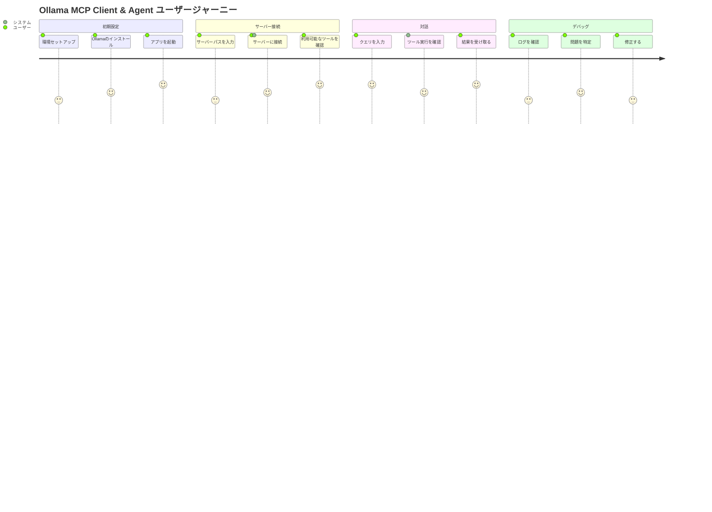
```mermaid
journey
    title Ollama MCP Client & Agent ユーザージャーニー
    section 初期設定
      環境セットアップ: 3: ユーザー
      Ollamaのインストール: 4: ユーザー
      アプリを起動: 5: ユーザー
    section サーバー接続
      サーバーパスを入力: 3: ユーザー
      サーバーに接続: 4: ユーザー, システム
      利用可能なツールを確認: 5: ユーザー
    section 対話
      クエリを入力: 5: ユーザー
      ツール実行を確認: 4: システム
      結果を受け取る: 5: ユーザー
    section デバッグ
      ログを確認: 3: ユーザー
      問題を特定: 4: ユーザー
      修正する: 3: ユーザー
```

## 主要なユーザーシナリオ

### 1. 初期設定と接続

ユーザーがアプリケーションを初期設定し、MCPサーバーに接続するフロー：

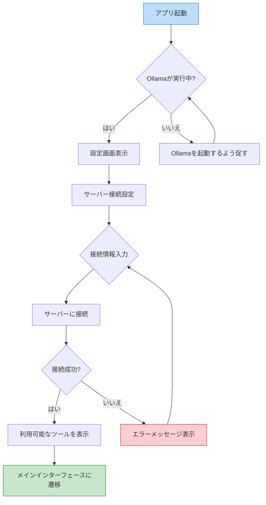
```mermaid
flowchart TD
    A[アプリ起動] --> B{Ollamaが実行中?}
    B -->|はい| C[設定画面表示]
    B -->|いいえ| B1[Ollamaを起動するよう促す]
    B1 --> B
    
    C --> D[サーバー接続設定]
    D --> E{接続情報入力}
    E --> F[サーバーに接続]
    F --> G{接続成功?}
    G -->|はい| H[利用可能なツールを表示]
    G -->|いいえ| G1[エラーメッセージ表示]
    G1 --> E
    
    H --> I[メインインターフェースに遷移]
    
    style A fill:#bbdefb,stroke:#1976d2
    style G1 fill:#ffcdd2,stroke:#c62828
    style I fill:#c8e6c9,stroke:#2e7d32
```

### 2. クエリ処理と対話

ユーザーがシステムと対話し、ツールを使用するフロー：

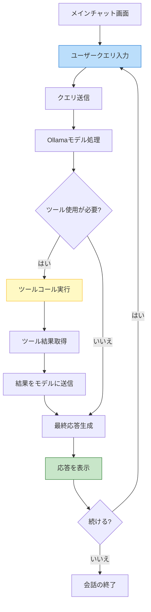
```mermaid
flowchart TD
    A[メインチャット画面] --> B[ユーザークエリ入力]
    B --> C[クエリ送信]
    C --> D[Ollamaモデル処理]
    D --> E{ツール使用が必要?}
    
    E -->|はい| F[ツールコール実行]
    F --> G[ツール結果取得]
    G --> H[結果をモデルに送信]
    H --> I[最終応答生成]
    
    E -->|いいえ| I
    
    I --> J[応答を表示]
    J --> K{続ける?}
    K -->|はい| B
    K -->|いいえ| L[会話の終了]
    
    style B fill:#bbdefb,stroke:#1976d2
    style F fill:#fff9c4,stroke:#fbc02d
    style J fill:#c8e6c9,stroke:#2e7d32
```

### 3. デバッグと問題解決

開発者がデバッグ情報を利用して問題を解決するフロー：

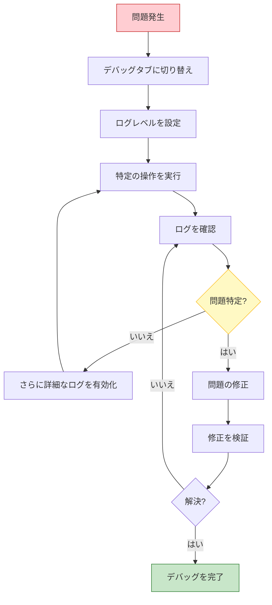
```mermaid
flowchart TD
    A[問題発生] --> B[デバッグタブに切り替え]
    B --> C[ログレベルを設定]
    C --> D[特定の操作を実行]
    D --> E[ログを確認]
    
    E --> F{問題特定?}
    F -->|いいえ| G[さらに詳細なログを有効化]
    G --> D
    
    F -->|はい| H[問題の修正]
    H --> I[修正を検証]
    I --> J{解決?}
    J -->|いいえ| E
    J -->|はい| K[デバッグを完了]
    
    style A fill:#ffcdd2,stroke:#c62828
    style F fill:#fff9c4,stroke:#fbc02d
    style K fill:#c8e6c9,stroke:#2e7d32
```

### 4. モデルとパラメータの調整

ユーザーがモデルとパラメータを調整するフロー：

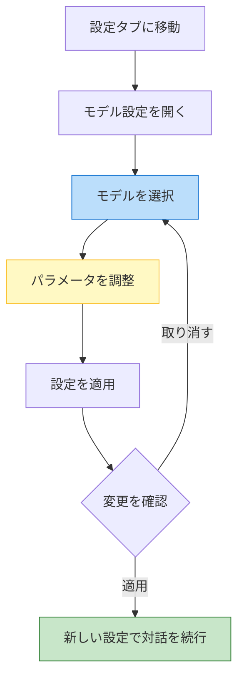
```mermaid
flowchart TD
    A[設定タブに移動] --> B[モデル設定を開く]
    B --> C[モデルを選択]
    C --> D[パラメータを調整]
    D --> E[設定を適用]
    E --> F{変更を確認}
    F -->|取り消す| C
    F -->|適用| G[新しい設定で対話を続行]
    
    style C fill:#bbdefb,stroke:#1976d2
    style D fill:#fff9c4,stroke:#fbc02d
    style G fill:#c8e6c9,stroke:#2e7d32
```

## 画面遷移図

アプリケーションの主要な画面とその遷移：

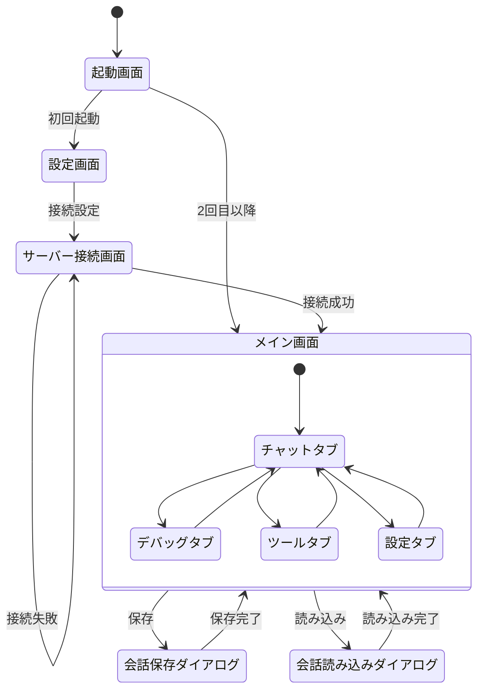
```mermaid
stateDiagram-v2
    [*] --> 起動画面
    起動画面 --> 設定画面: 初回起動
    起動画面 --> メイン画面: 2回目以降
    
    設定画面 --> サーバー接続画面: 接続設定
    サーバー接続画面 --> メイン画面: 接続成功
    サーバー接続画面 --> サーバー接続画面: 接続失敗
    
    state メイン画面 {
        [*] --> チャットタブ
        チャットタブ --> デバッグタブ
        デバッグタブ --> チャットタブ
        チャットタブ --> ツールタブ
        ツールタブ --> チャットタブ
        チャットタブ --> 設定タブ
        設定タブ --> チャットタブ
    }
    
    メイン画面 --> 会話保存ダイアログ: 保存
    会話保存ダイアログ --> メイン画面: 保存完了
    
    メイン画面 --> 会話読み込みダイアログ: 読み込み
    会話読み込みダイアログ --> メイン画面: 読み込み完了
```

## 主要画面の目的

### 1. 起動画面

- **目的**: アプリケーションの初期化と環境確認
- **機能**:
  - Ollamaの実行確認
  - 前回の設定の読み込み
  - 初回起動時の設定ガイド

### 2. 設定画面

- **目的**: アプリケーション全体の設定
- **機能**:
  - ユーザープロファイル設定
  - デフォルトモデル設定
  - デバッグレベル設定
  - テーマ設定

### 3. サーバー接続画面

- **目的**: MCPサーバーとの接続設定
- **機能**:
  - サーバーパス入力
  - 接続パラメータ設定
  - 接続テスト
  - 利用可能なツールの表示

### 4. メイン画面（チャットタブ）

- **目的**: LLMエージェントとの対話
- **機能**:
  - メッセージ入力
  - 会話履歴表示
  - ツール実行の表示
  - 会話の保存/読み込み

### 5. メイン画面（デバッグタブ）

- **目的**: 開発とデバッグ支援
- **機能**:
  - ログ表示と検索
  - メッセージトレース
  - ツールコール履歴
  - エラー情報の表示

### 6. メイン画面（ツールタブ）

- **目的**: 利用可能なツールの管理
- **機能**:
  - ツール一覧表示
  - ツール詳細情報
  - ツール使用統計
  - ツールスキーマ表示

### 7. メイン画面（設定タブ）

- **目的**: 実行時設定の調整
- **機能**:
  - モデル選択
  - パラメータ調整
  - サーバー再接続
  - デバッグ設定

## 重要な意思決定ポイント

アプリケーション内の主要な意思決定ポイントとその選択肢：

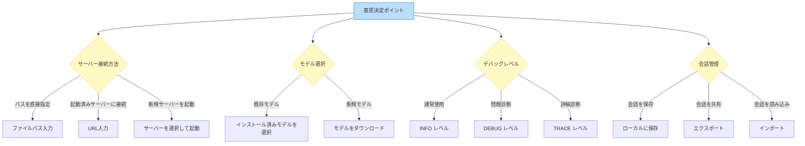
```mermaid
flowchart TD
    A[意思決定ポイント] --> B{サーバー接続方法}
    B -->|パスを直接指定| B1[ファイルパス入力]
    B -->|起動済みサーバーに接続| B2[URL入力]
    B -->|新規サーバーを起動| B3[サーバーを選択して起動]
    
    A --> C{モデル選択}
    C -->|既存モデル| C1[インストール済みモデルを選択]
    C -->|新規モデル| C2[モデルをダウンロード]
    
    A --> D{デバッグレベル}
    D -->|通常使用| D1[INFO レベル]
    D -->|問題診断| D2[DEBUG レベル]
    D -->|詳細診断| D3[TRACE レベル]
    
    A --> E{会話管理}
    E -->|会話を保存| E1[ローカルに保存]
    E -->|会話を共有| E2[エクスポート]
    E -->|会話を読み込み| E3[インポート]
    
    style A fill:#bbdefb,stroke:#1976d2
    style B fill:#fff9c4,stroke:#fbc02d
    style C fill:#fff9c4,stroke:#fbc02d
    style D fill:#fff9c4,stroke:#fbc02d
    style E fill:#fff9c4,stroke:#fbc02d
```

## エラーケースと代替フロー

### 1. サーバー接続エラー

サーバーに接続できない場合の代替フロー：

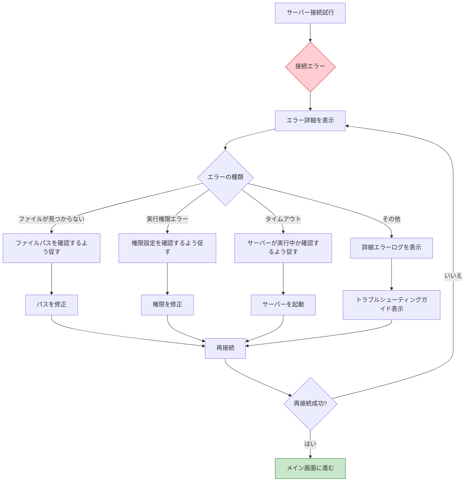
```mermaid
flowchart TD
    A[サーバー接続試行] --> B{接続エラー}
    B --> C[エラー詳細を表示]
    C --> D{エラーの種類}
    
    D -->|ファイルが見つからない| E[ファイルパスを確認するよう促す]
    D -->|実行権限エラー| F[権限設定を確認するよう促す]
    D -->|タイムアウト| G[サーバーが実行中か確認するよう促す]
    D -->|その他| H[詳細エラーログを表示]
    
    E --> I[パスを修正]
    F --> J[権限を修正]
    G --> K[サーバーを起動]
    H --> L[トラブルシューティングガイド表示]
    
    I --> M[再接続]
    J --> M
    K --> M
    L --> M
    
    M --> N{再接続成功?}
    N -->|はい| O[メイン画面に進む]
    N -->|いいえ| C
    
    style B fill:#ffcdd2,stroke:#c62828
    style O fill:#c8e6c9,stroke:#2e7d32
```

### 2. ツール実行エラー

ツール実行中にエラーが発生した場合の処理フロー：

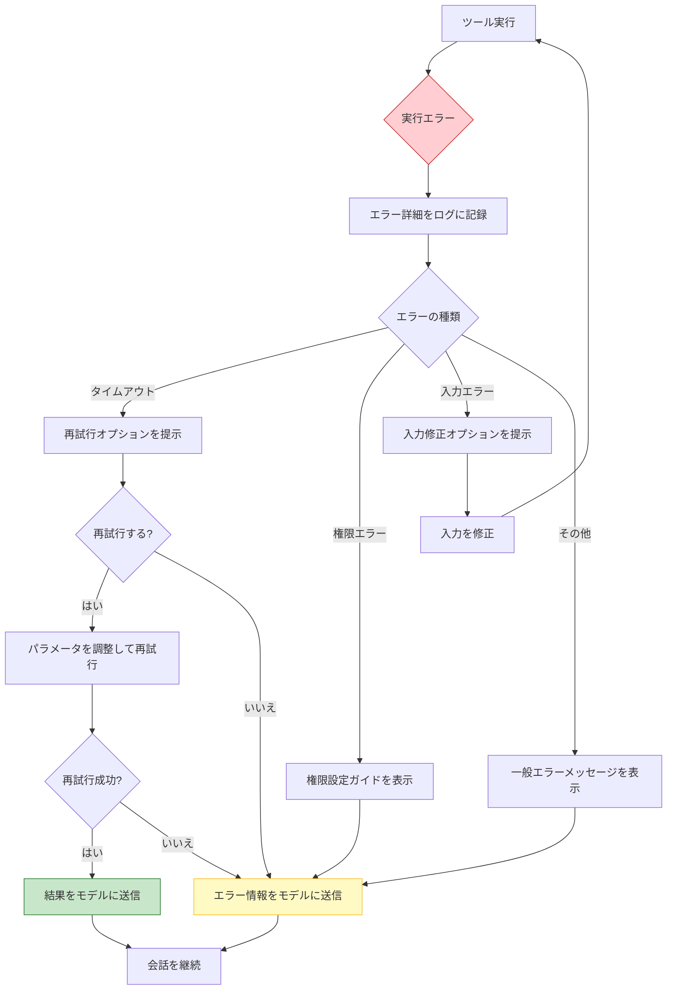
```mermaid
flowchart TD
    A[ツール実行] --> B{実行エラー}
    B --> C[エラー詳細をログに記録]
    C --> D{エラーの種類}
    
    D -->|タイムアウト| E[再試行オプションを提示]
    D -->|権限エラー| F[権限設定ガイドを表示]
    D -->|入力エラー| G[入力修正オプションを提示]
    D -->|その他| H[一般エラーメッセージを表示]
    
    E --> I{再試行する?}
    I -->|はい| J[パラメータを調整して再試行]
    I -->|いいえ| K[エラー情報をモデルに送信]
    
    F --> K
    G --> L[入力を修正]
    L --> A
    H --> K
    
    J --> M{再試行成功?}
    M -->|はい| N[結果をモデルに送信]
    M -->|いいえ| K
    
    K --> O[会話を継続]
    N --> O
    
    style B fill:#ffcdd2,stroke:#c62828
    style K fill:#fff9c4,stroke:#fbc02d
    style N fill:#c8e6c9,stroke:#2e7d32
```

### 3. Ollamaモデル実行エラー

Ollamaモデルの実行中にエラーが発生した場合の処理フロー：

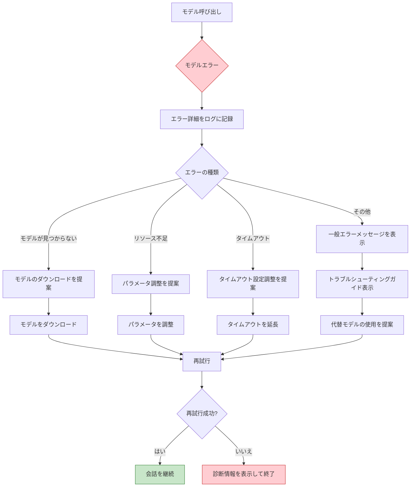
```mermaid
flowchart TD
    A[モデル呼び出し] --> B{モデルエラー}
    B --> C[エラー詳細をログに記録]
    C --> D{エラーの種類}
    
    D -->|モデルが見つからない| E[モデルのダウンロードを提案]
    D -->|リソース不足| F[パラメータ調整を提案]
    D -->|タイムアウト| G[タイムアウト設定調整を提案]
    D -->|その他| H[一般エラーメッセージを表示]
    
    E --> I[モデルをダウンロード]
    I --> J[再試行]
    
    F --> K[パラメータを調整]
    K --> J
    
    G --> L[タイムアウトを延長]
    L --> J
    
    H --> M[トラブルシューティングガイド表示]
    M --> N[代替モデルの使用を提案]
    N --> J
    
    J --> O{再試行成功?}
    O -->|はい| P[会話を継続]
    O -->|いいえ| Q[診断情報を表示して終了]
    
    style B fill:#ffcdd2,stroke:#c62828
    style P fill:#c8e6c9,stroke:#2e7d32
    style Q fill:#ffcdd2,stroke:#c62828
```

### 4. ファイルシステムアクセスエラー

設定ファイルや会話履歴の読み書き時にエラーが発生した場合の処理フロー：

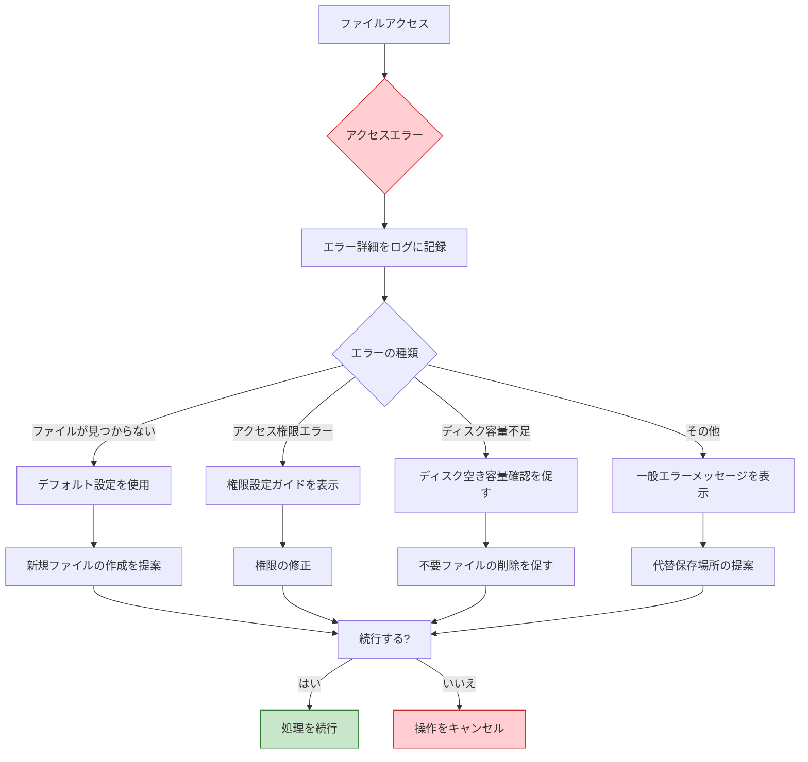
```mermaid
flowchart TD
    A[ファイルアクセス] --> B{アクセスエラー}
    B --> C[エラー詳細をログに記録]
    C --> D{エラーの種類}
    
    D -->|ファイルが見つからない| E[デフォルト設定を使用]
    D -->|アクセス権限エラー| F[権限設定ガイドを表示]
    D -->|ディスク容量不足| G[ディスク空き容量確認を促す]
    D -->|その他| H[一般エラーメッセージを表示]
    
    E --> I[新規ファイルの作成を提案]
    F --> J[権限の修正]
    G --> K[不要ファイルの削除を促す]
    H --> L[代替保存場所の提案]
    
    I --> M[続行する?]
    J --> M
    K --> M
    L --> M
    
    M -->|はい| N[処理を続行]
    M -->|いいえ| O[操作をキャンセル]
    
    style B fill:#ffcdd2,stroke:#c62828
    style N fill:#c8e6c9,stroke:#2e7d32
    style O fill:#ffcdd2,stroke:#c62828
```

## ユーザーインターフェースの概略図

### メイン画面レイアウト

```
+----------------------------------------------------+
| Ollama MCP Client & Agent                      [_][X]|
+------------------+-------------------------------+
| [接続状態]       | [モデル: llama3]   [デバッグ: INFO] |
+------------------+-------------------------------+
|                                                  |
| +----------------+                               |
| | チャット | デバッグ | ツール | 設定 |           |
| +----------------+                               |
|                                                  |
| +------------------------------------------------+
| |                                                |
| |                                                |
| |                                                |
| |              会話履歴表示エリア                  |
| |                                                |
| |                                                |
| |                                                |
| +------------------------------------------------+
|                                                  |
| +------------------------------------------------+
| | メッセージ入力                                  |
| +---------------+                                |
| |               | [送信]                         |
| +---------------+                                |
+--------------------------------------------------+
```

### デバッグ画面レイアウト

```
+----------------------------------------------------+
| Ollama MCP Client & Agent                      [_][X]|
+------------------+-------------------------------+
| [接続状態]       | [モデル: llama3]   [デバッグ: DEBUG] |
+------------------+-------------------------------+
|                                                  |
| +-------------------------------------------+     |
| | チャット | デバッグ | ツール | 設定 |           |
| +-------------------------------------------+     |
|                                                  |
| +-------------------+---------------------------+
| | [ログ | ツールコール | エラー]                   |
| +-------------------+---------------------------+
| |                                                |
| |              ログ表示エリア                     |
| |                                                |
| |                                                |
| +------------------------------------------------+
|                                                  |
| +------------------------------------------------+
| | [レベル: DEBUG ▼] [自動更新 ✓] [更新] [エクスポート] |
| +------------------------------------------------+
+--------------------------------------------------+
```

## ユーザー体験の最適化

### 1. フィードバックメカニズム

ユーザーに適切なフィードバックを提供するためのメカニズム：

- **ローディングインジケーター**: 長時間実行操作の進行状況を表示
- **接続状態表示**: サーバーとの接続状態をリアルタイムで表示
- **ツール実行フィードバック**: ツール実行の進行状況と結果を表示
- **エラー通知**: エラー発生時に視覚的なフィードバックを提供
- **成功通知**: 操作成功時に確認のフィードバックを提供

### 2. 初期ユーザー向けガイダンス

初めてのユーザーを支援するガイダンス機能：

- **ウェルカムガイド**: 初回起動時にアプリケーションの概要を説明
- **ツアー機能**: 主要機能を順に紹介する対話式ツアー
- **ヘルプポップオーバー**: UI要素にカーソルを合わせると説明が表示
- **ヒント表示**: 未使用の主要機能についてのヒントを表示
- **クイックスタートチュートリアル**: 基本的な使用方法を短時間で学べるチュートリアル

### 3. アクセシビリティ

さまざまなユーザーに対応するアクセシビリティ機能：

- **キーボードナビゲーション**: すべての機能をキーボードでアクセス可能に
- **スクリーンリーダー対応**: 適切なARIAラベルと構造を提供
- **高コントラストモード**: 視覚障害のあるユーザー向けの色設定
- **フォントサイズ調整**: 文字サイズを変更可能に
- **言語設定**: 複数言語への対応

## アプリケーションフローの進化

機能拡張に伴うアプリケーションフローの計画的な進化：

### Phase 1: 基本機能（現在）

- MCPサーバー接続
- 基本的な対話機能
- シンプルなデバッグビュー
- 単一モデル対応

### Phase 2: 拡張機能

- 複数モデル対応
- デバッグ情報の可視化
- 会話履歴の管理
- ツール使用統計

### Phase 3: 高度な機能

- エージェント拡張機能
- カスタムツール定義
- ワークフロー自動化
- コラボレーション機能

## まとめ

Ollama MCP Client & Agent アプリケーションは、ユーザーフレンドリーなインターフェースを通じてMCPサーバーとの連携を効率化し、デバッグ機能を提供し、AIエージェント能力を拡張するように設計されています。上記のフローと遷移図は、アプリケーションの基本的な動作と拡張可能性を示しています。

このドキュメントは開発の進行に伴って更新される予定であり、フィードバックやユーザビリティテストの結果に基づいて最適化が行われます。

## MCPサーバー情報可視化フロー

### 1. サーバーモニタリングフロー

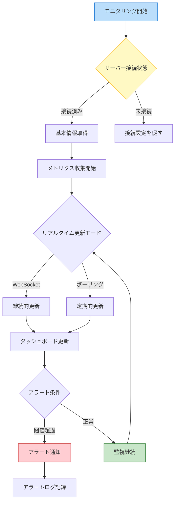
```mermaid
flowchart TD
    A[モニタリング開始] --> B{サーバー接続状態}
    B -->|接続済み| C[基本情報取得]
    B -->|未接続| D[接続設定を促す]
    
    C --> E[メトリクス収集開始]
    E --> F{リアルタイム更新モード}
    
    F -->|WebSocket| G[継続的更新]
    F -->|ポーリング| H[定期的更新]
    
    G --> I[ダッシュボード更新]
    H --> I
    
    I --> J{アラート条件}
    J -->|閾値超過| K[アラート通知]
    J -->|正常| L[監視継続]
    
    K --> M[アラートログ記録]
    L --> F
    
    style A fill:#bbdefb,stroke:#1976d2
    style B fill:#fff9c4,stroke:#fbc02d
    style K fill:#ffcdd2,stroke:#c62828
    style L fill:#c8e6c9,stroke:#2e7d32
```

### 2. ツール分析フロー

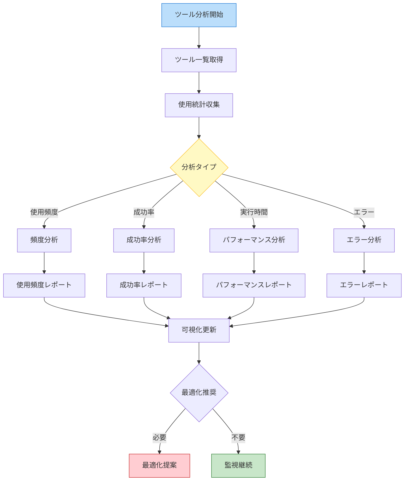
```mermaid
flowchart TD
    A[ツール分析開始] --> B[ツール一覧取得]
    B --> C[使用統計収集]
    C --> D{分析タイプ}
    
    D -->|使用頻度| E[頻度分析]
    D -->|成功率| F[成功率分析]
    D -->|実行時間| G[パフォーマンス分析]
    D -->|エラー| H[エラー分析]
    
    E --> I[使用頻度レポート]
    F --> J[成功率レポート]
    G --> K[パフォーマンスレポート]
    H --> L[エラーレポート]
    
    I --> M[可視化更新]
    J --> M
    K --> M
    L --> M
    
    M --> N{最適化推奨}
    N -->|必要| O[最適化提案]
    N -->|不要| P[監視継続]
    
    style A fill:#bbdefb,stroke:#1976d2
    style D fill:#fff9c4,stroke:#fbc02d
    style O fill:#ffcdd2,stroke:#c62828
    style P fill:#c8e6c9,stroke:#2e7d32
```

### 3. エラー分析フロー

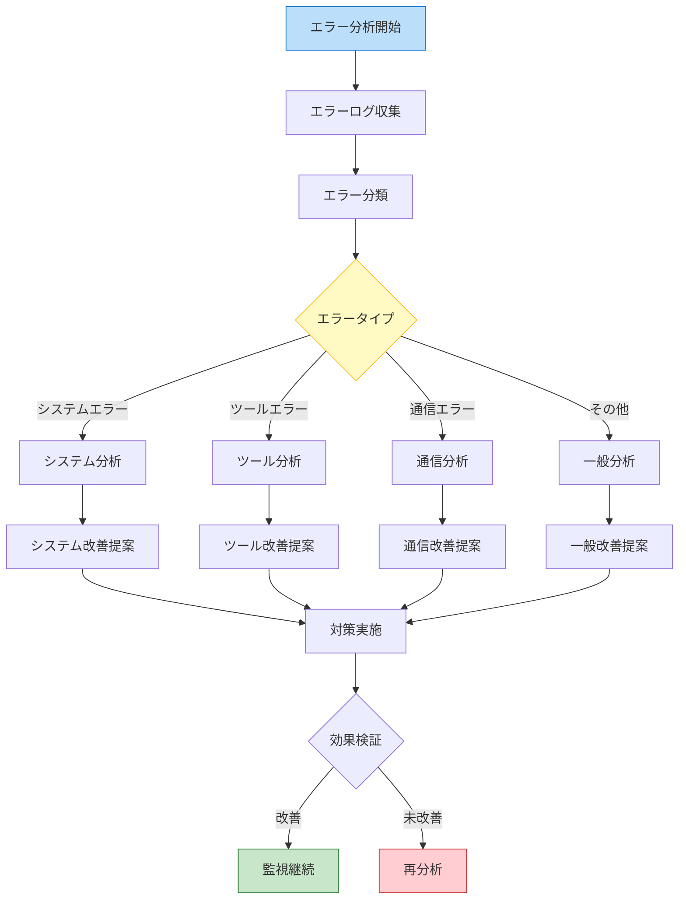
```mermaid
flowchart TD
    A[エラー分析開始] --> B[エラーログ収集]
    B --> C[エラー分類]
    C --> D{エラータイプ}
    
    D -->|システムエラー| E[システム分析]
    D -->|ツールエラー| F[ツール分析]
    D -->|通信エラー| G[通信分析]
    D -->|その他| H[一般分析]
    
    E --> I[システム改善提案]
    F --> J[ツール改善提案]
    G --> K[通信改善提案]
    H --> L[一般改善提案]
    
    I --> M[対策実施]
    J --> M
    K --> M
    L --> M
    
    M --> N{効果検証}
    N -->|改善| O[監視継続]
    N -->|未改善| P[再分析]
    
    style A fill:#bbdefb,stroke:#1976d2
    style D fill:#fff9c4,stroke:#fbc02d
    style P fill:#ffcdd2,stroke:#c62828
    style O fill:#c8e6c9,stroke:#2e7d32
```

### 4. パフォーマンス最適化フロー

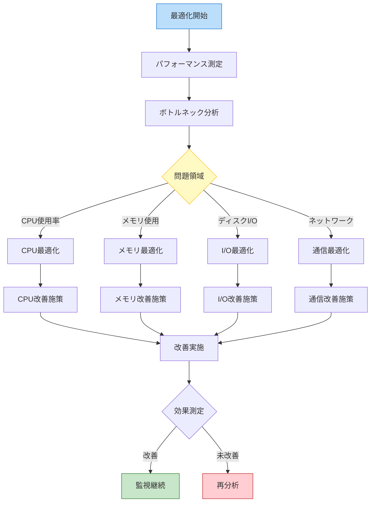
```mermaid
flowchart TD
    A[最適化開始] --> B[パフォーマンス測定]
    B --> C[ボトルネック分析]
    C --> D{問題領域}
    
    D -->|CPU使用率| E[CPU最適化]
    D -->|メモリ使用| F[メモリ最適化]
    D -->|ディスクI/O| G[I/O最適化]
    D -->|ネットワーク| H[通信最適化]
    
    E --> I[CPU改善施策]
    F --> J[メモリ改善施策]
    G --> K[I/O改善施策]
    H --> L[通信改善施策]
    
    I --> M[改善実施]
    J --> M
    K --> M
    L --> M
    
    M --> N{効果測定}
    N -->|改善| O[監視継続]
    N -->|未改善| P[再分析]
    
    style A fill:#bbdefb,stroke:#1976d2
    style D fill:#fff9c4,stroke:#fbc02d
    style P fill:#ffcdd2,stroke:#c62828
    style O fill:#c8e6c9,stroke:#2e7d32
```

### 5. アラート管理フロー

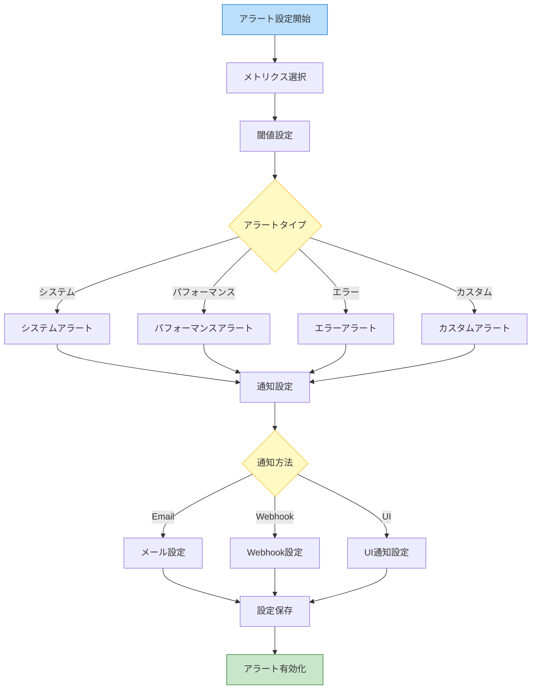
```mermaid
flowchart TD
    A[アラート設定開始] --> B[メトリクス選択]
    B --> C[閾値設定]
    C --> D{アラートタイプ}
    
    D -->|システム| E[システムアラート]
    D -->|パフォーマンス| F[パフォーマンスアラート]
    D -->|エラー| G[エラーアラート]
    D -->|カスタム| H[カスタムアラート]
    
    E --> I[通知設定]
    F --> I
    G --> I
    H --> I
    
    I --> J{通知方法}
    J -->|Email| K[メール設定]
    J -->|Webhook| L[Webhook設定]
    J -->|UI| M[UI通知設定]
    
    K --> N[設定保存]
    L --> N
    M --> N
    
    N --> O[アラート有効化]
    
    style A fill:#bbdefb,stroke:#1976d2
    style D fill:#fff9c4,stroke:#fbc02d
    style J fill:#fff9c4,stroke:#fbc02d
    style O fill:#c8e6c9,stroke:#2e7d32
```

## 画面遷移図

### MCPモニタリング画面遷移

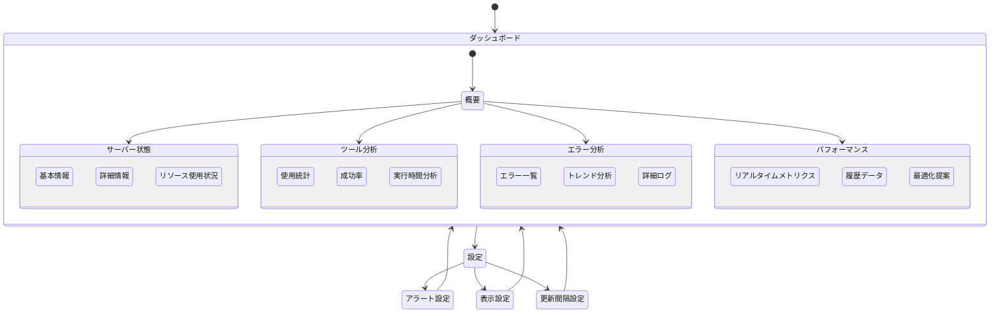
```mermaid
stateDiagram-v2
    [*] --> ダッシュボード
    
    state ダッシュボード {
        [*] --> 概要
        概要 --> サーバー状態
        概要 --> ツール分析
        概要 --> エラー分析
        概要 --> パフォーマンス
        
        state サーバー状態 {
            基本情報
            詳細情報
            リソース使用状況
        }
        
        state ツール分析 {
            使用統計
            成功率
            実行時間分析
        }
        
        state エラー分析 {
            エラー一覧
            トレンド分析
            詳細ログ
        }
        
        state パフォーマンス {
            リアルタイムメトリクス
            履歴データ
            最適化提案
        }
    }
    
    ダッシュボード --> 設定
    設定 --> アラート設定
    設定 --> 表示設定
    設定 --> 更新間隔設定
    
    アラート設定 --> ダッシュボード
    表示設定 --> ダッシュボード
    更新間隔設定 --> ダッシュボード
```

## エラーケースとリカバリー

### 1. 接続エラー処理

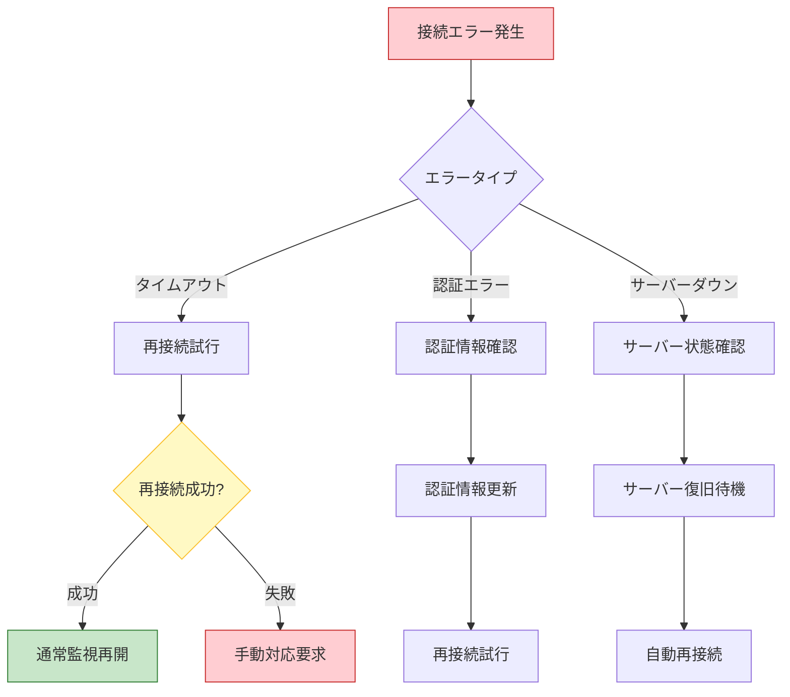
```mermaid
flowchart TD
    A[接続エラー発生] --> B{エラータイプ}
    B -->|タイムアウト| C[再接続試行]
    B -->|認証エラー| D[認証情報確認]
    B -->|サーバーダウン| E[サーバー状態確認]
    
    C --> F{再接続成功?}
    F -->|成功| G[通常監視再開]
    F -->|失敗| H[手動対応要求]
    
    D --> I[認証情報更新]
    I --> J[再接続試行]
    
    E --> K[サーバー復旧待機]
    K --> L[自動再接続]
    
    style A fill:#ffcdd2,stroke:#c62828
    style F fill:#fff9c4,stroke:#fbc02d
    style G fill:#c8e6c9,stroke:#2e7d32
    style H fill:#ffcdd2,stroke:#c62828
```

### 2. データ収集エラー処理

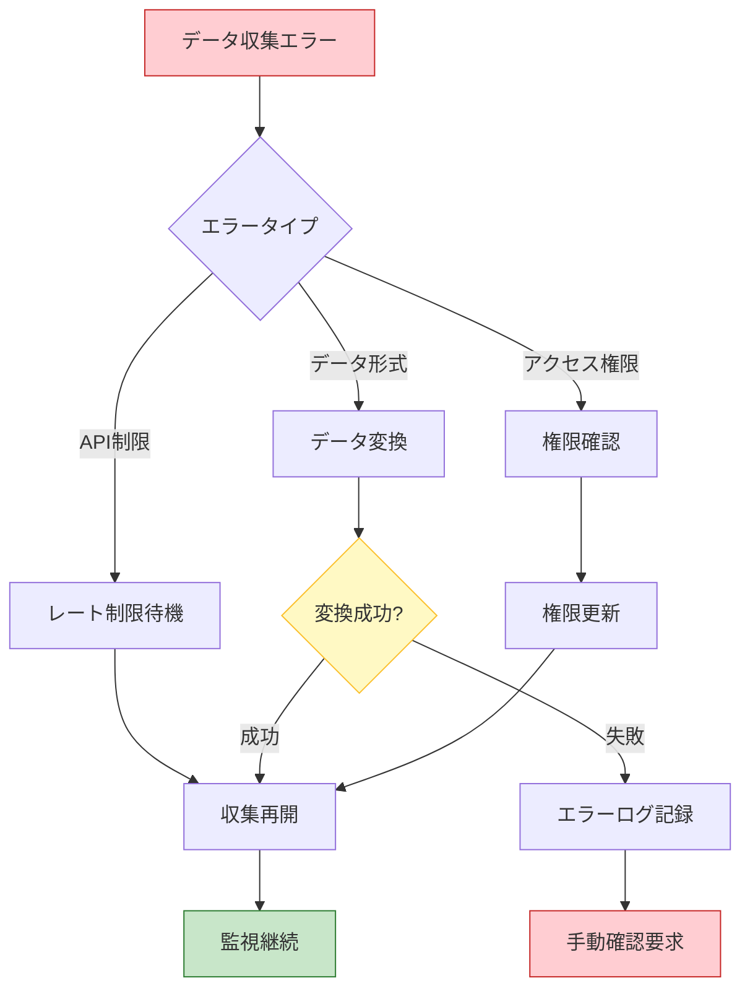
```mermaid
flowchart TD
    A[データ収集エラー] --> B{エラータイプ}
    B -->|API制限| C[レート制限待機]
    B -->|データ形式| D[データ変換]
    B -->|アクセス権限| E[権限確認]
    
    C --> F[収集再開]
    D --> G{変換成功?}
    G -->|成功| F
    G -->|失敗| H[エラーログ記録]
    
    E --> I[権限更新]
    I --> F
    
    F --> J[監視継続]
    H --> K[手動確認要求]
    
    style A fill:#ffcdd2,stroke:#c62828
    style G fill:#fff9c4,stroke:#fbc02d
    style J fill:#c8e6c9,stroke:#2e7d32
    style K fill:#ffcdd2,stroke:#c62828
```

## 主要な操作シーケンス

### 1. リアルタイムモニタリング

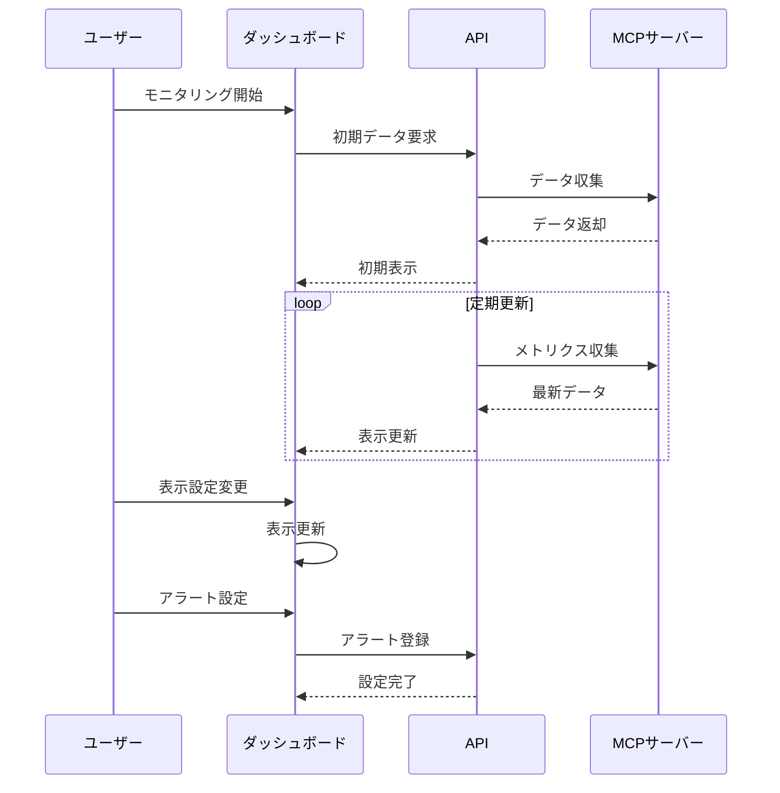
```mermaid
sequenceDiagram
    participant U as ユーザー
    participant D as ダッシュボード
    participant A as API
    participant S as MCPサーバー
    
    U->>D: モニタリング開始
    D->>A: 初期データ要求
    A->>S: データ収集
    S-->>A: データ返却
    A-->>D: 初期表示
    
    loop 定期更新
        A->>S: メトリクス収集
        S-->>A: 最新データ
        A-->>D: 表示更新
    end
    
    U->>D: 表示設定変更
    D->>D: 表示更新
    
    U->>D: アラート設定
    D->>A: アラート登録
    A-->>D: 設定完了
```

### 2. 詳細分析操作

```mermaid
sequenceDiagram
    participant U as ユーザー
    participant D as ダッシュボード
    participant A as 分析エンジン
    participant DB as データストア
    
    U->>D: 詳細分析要求
    D->>A: 分析開始
    A->>DB: 履歴データ取得
    DB-->>A: データ返却
    
    A->>A: データ分析
    A-->>D: 分析結果表示
    
    U->>D: フィルター適用
    D->>A: 再分析要求
    A->>A: フィルター処理
    A-->>D: 結果更新
    
    U->>D: レポート生成
    D->>A: レポート作成
    A-->>D: レポート表示
```