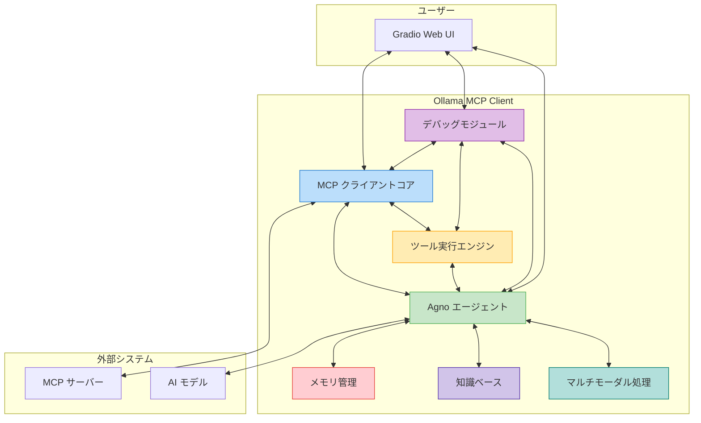
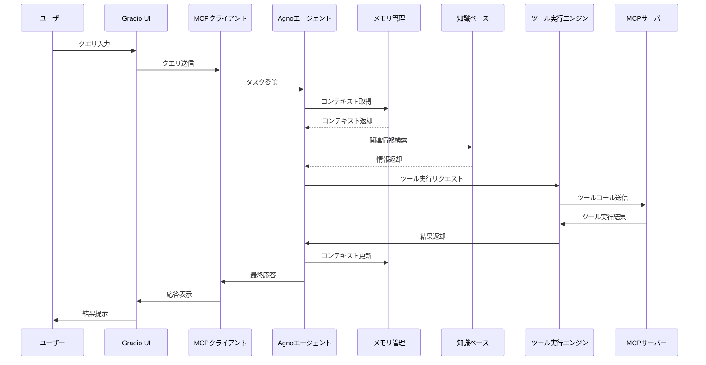
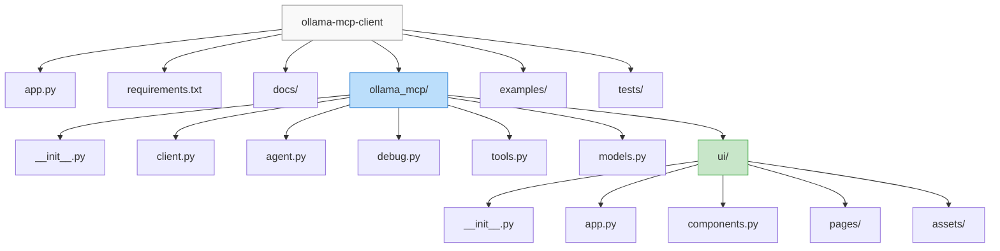
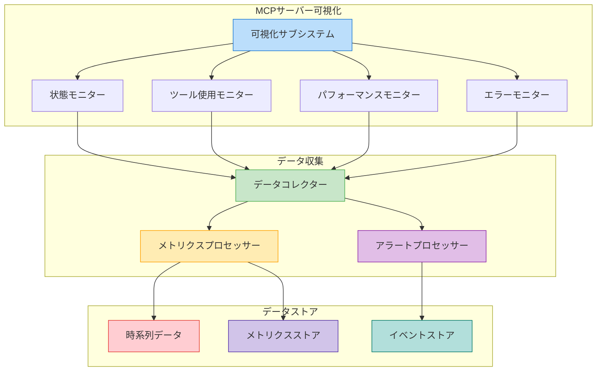
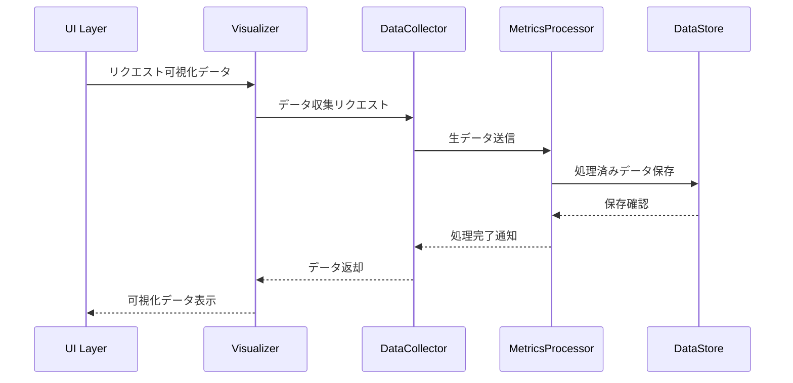
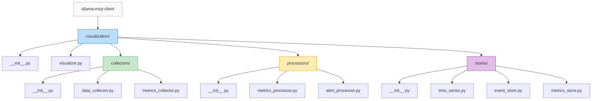

# アーキテクチャ概要

このドキュメントは Ollama MCP Client & Agent の全体的なアーキテクチャについて説明します。

## システム概要

Ollama MCP Client & Agent は、Model Context Protocol (MCP) サーバーと Agno フレームワークを統合し、マルチモーダル対応の拡張可能なエージェントフレームワークを提供するシステムです。

## 主要コンポーネント

### 1. MCP クライアントコア

MCP プロトコルに準拠した通信を担当するコンポーネントです。

- **Session Manager**: MCP サーバーとの接続管理
- **Message Handler**: プロトコルメッセージの処理
- **Tool Registry**: 利用可能なツールの登録と管理

### 2. Agno エージェント

Agno フレームワークを使用したエージェント機能を提供するコンポーネントです。

- **Agent Manager**: エージェントの作成と管理
- **Model Integration**: 各種AIモデルとの統合
- **Tool Execution**: ツールの実行と結果処理
- **Multimodal Processing**: テキスト、画像、音声、動画の処理

### 3. メモリ管理

エージェントのメモリと状態を管理するコンポーネントです。

- **Session Memory**: 会話セッションの管理
- **State Manager**: エージェント状態の保持
- **Context Handler**: コンテキスト情報の管理
- **Database Integration**: 永続化ストレージとの連携

### 4. 知識ベース

エージェントの知識を管理するコンポーネントです。

- **Vector Store**: ベクトルデータベースの管理
- **Document Processor**: ドキュメントの処理と保存
- **Search Engine**: 関連情報の検索
- **Knowledge Update**: 知識の更新と維持

### 5. マルチモーダル処理

各種メディアの処理を担当するコンポーネントです。

- **Image Processor**: 画像処理と分析
- **Audio Handler**: 音声処理と変換
- **Video Manager**: 動画処理と解析
- **Media Integration**: マルチメディアの統合

### 6. デバッグモジュール

詳細なロギングと問題診断機能を提供するコンポーネントです。

- **Logger**: 構造化ログの記録
- **Message Inspector**: 通信メッセージの検査
- **Tracer**: ツールコールと実行の追跡
- **Error Analyzer**: エラーパターンの分析
- **Performance Monitor**: パフォーマンスの監視と分析

### 7. Gradio Web UI

ユーザーインターフェースを提供するコンポーネントです。

- **Chat Interface**: 対話インターフェース
- **Debug View**: デバッグ情報の可視化
- **Settings Panel**: 構成管理
- **Tool Editor**: ツール定義の編集
- **Media Upload**: マルチメディアのアップロード
- **Performance Dashboard**: パフォーマンス指標の表示

## データフロー

## フォルダ構成

## 技術選定

| コンポーネント | 技術 | 選定理由 |
|----------------|------|----------|
| バックエンド言語 | Python 3.10 | 機械学習ライブラリとの広範な互換性、asyncio での非同期処理サポート |
| エージェントフレームワーク | Agno | 軽量で高速、マルチモーダル対応、モデル非依存の設計 |
| MCP クライアント | 純正 Python | MCP プロトコルとの直接統合、柔軟性の確保 |
| ウェブ UI | Gradio | 迅速な UI 開発、ML プロジェクトとの相性の良さ、コンポーネント豊富 |
| 依存関係管理 | uv | 高速なパッケージインストール、仮想環境管理の容易さ |
| 非同期処理 | asyncio | 効率的な I/O 処理、複数の接続とリクエストの並行処理 |
| テスト | pytest | 豊富なテスト機能、asyncio 対応のテストサポート |
| ロギング | loguru | 構造化ログ、非同期サポート、使いやすいAPI |

## アーキテクチャの原則

1. **モジュール性**: 機能を明確に分離し、独立して開発・テスト可能なコンポーネント設計
2. **拡張性**: プラグインやカスタム拡張が容易な柔軟な基盤
3. **透明性**: デバッグのために内部動作を可視化する仕組み
4. **使いやすさ**: 開発者と一般ユーザーの両方にとって直感的なインターフェース
5. **堅牢性**: エラー処理と回復メカニズムの組み込み
6. **パフォーマンス**: 高速な処理と効率的なリソース利用
7. **マルチモーダル**: 各種メディアの効率的な処理と統合

このアーキテクチャにより、MCPサーバーとAgnoフレームワークを効率的に統合し、高度なマルチモーダルエージェント機能を提供することが可能になります。

## MCPサーバー情報可視化コンポーネント

### コンポーネントの責務

#### 可視化サブシステム
- **状態モニター**: サーバーの基本状態と接続情報の表示
- **ツール使用モニター**: ツールの使用統計と分析
- **パフォーマンスモニター**: リアルタイムパフォーマンス指標の表示
- **エラーモニター**: エラー情報の集約と分析

#### データ収集
- **データコレクター**: 各種メトリクスとイベントの収集
- **メトリクスプロセッサー**: 収集データの処理と集計
- **アラートプロセッサー**: 異常検知とアラート生成

#### データストア
- **時系列データ**: 時系列メトリクスの保存
- **イベントストア**: システムイベントの記録
- **メトリクスストア**: 集計済みメトリクスの保存

### データフロー

### フォルダ構成の更新

