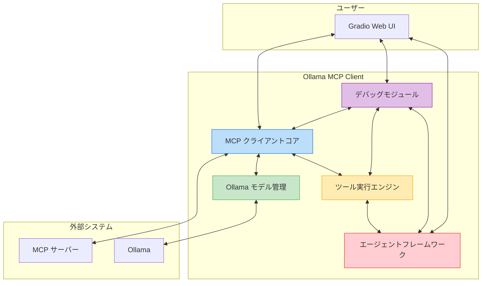
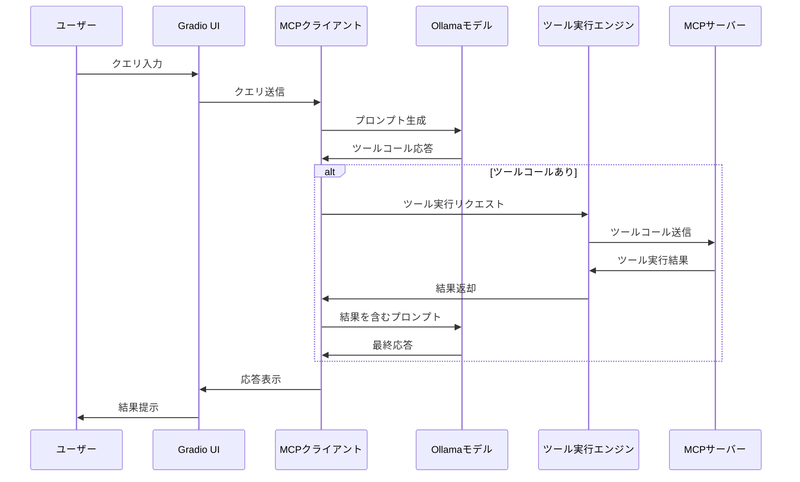
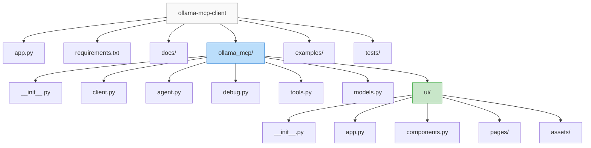

# アーキテクチャ概要

このドキュメントは Ollama MCP Client & Agent の全体的なアーキテクチャについて説明します。

## システム概要

Ollama MCP Client & Agent は、Model Context Protocol (MCP) サーバーと Ollama の LLM 機能を統合し、拡張可能なエージェントフレームワークを提供するシステムです。

## 主要コンポーネント

### 1. MCP クライアントコア

MCP プロトコルに準拠した通信を担当するコンポーネントです。

- **Session Manager**: MCP サーバーとの接続管理
- **Message Handler**: プロトコルメッセージの処理
- **Tool Registry**: 利用可能なツールの登録と管理

### 2. Ollama モデル管理

Ollama LLM モデルとの対話を管理するコンポーネントです。

- **Model Loader**: モデルのロードと切り替え
- **Context Manager**: プロンプトとコンテキストの管理
- **Response Parser**: モデル出力の解析

### 3. ツール実行エンジン

ツールの定義、呼び出し、結果処理を担当するコンポーネントです。

- **Tool Executor**: ツールコールの実行
- **Result Formatter**: 結果の整形と変換
- **Schema Validator**: ツール入出力の検証

### 4. デバッグモジュール

詳細なロギングと問題診断機能を提供するコンポーネントです。

- **Logger**: 構造化ログの記録
- **Message Inspector**: 通信メッセージの検査
- **Tracer**: ツールコールと実行の追跡
- **Error Analyzer**: エラーパターンの分析

### 5. エージェントフレームワーク

高度なエージェント機能を提供する拡張コンポーネントです。

- **Planning Engine**: タスク分解と計画
- **Memory Manager**: コンテキストと状態の管理
- **Plugin System**: 機能拡張のためのプラグイン基盤

### 6. Gradio Web UI

ユーザーインターフェースを提供するコンポーネントです。

- **Chat Interface**: 対話インターフェース
- **Debug View**: デバッグ情報の可視化
- **Settings Panel**: 構成管理
- **Tool Editor**: ツール定義の編集

## データフロー

## フォルダ構成

## 技術選定

| コンポーネント | 技術 | 選定理由 |
|----------------|------|----------|
| バックエンド言語 | Python 3.10 | 機械学習ライブラリとの広範な互換性、asyncio での非同期処理サポート |
| MCP クライアント | 純正 Python | MCP プロトコルとの直接統合、柔軟性の確保 |
| LLM インターフェース | Ollama | ローカル実行可能な多様なモデルの提供、API の容易さ |
| ウェブ UI | Gradio | 迅速な UI 開発、ML プロジェクトとの相性の良さ、コンポーネント豊富 |
| 依存関係管理 | uv | 高速なパッケージインストール、仮想環境管理の容易さ |
| 非同期処理 | asyncio | 効率的な I/O 処理、複数の接続とリクエストの並行処理 |
| テスト | pytest | 豊富なテスト機能、asyncio 対応のテストサポート |

## アーキテクチャの原則

1. **モジュール性**: 機能を明確に分離し、独立して開発・テスト可能なコンポーネント設計
2. **拡張性**: プラグインやカスタム拡張が容易な柔軟な基盤
3. **透明性**: デバッグのために内部動作を可視化する仕組み
4. **使いやすさ**: 開発者と一般ユーザーの両方にとって直感的なインターフェース
5. **堅牢性**: エラー処理と回復メカニズムの組み込み

このアーキテクチャにより、MCPサーバーとの連携問題を効率的にデバッグしながら、エージェント機能を拡張していくことが可能になります。