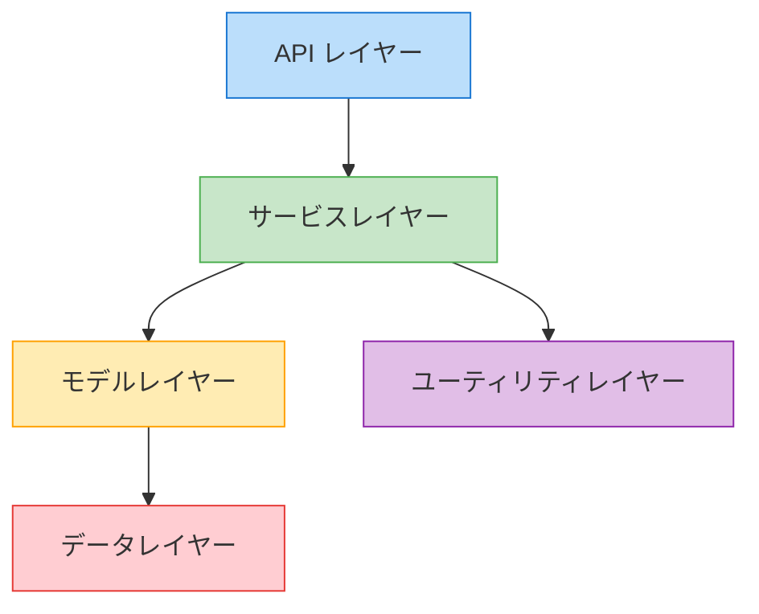
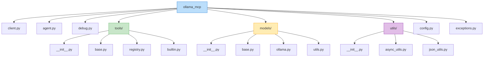

# バックエンド開発ガイド

このドキュメントでは、Ollama MCP Client & Agent のバックエンド開発に関するガイドラインを提供します。

## アーキテクチャ概要

バックエンドは以下のレイヤー構造に基づいて設計されています：



### レイヤーの責務

- **API レイヤー**: Gradio インターフェースと外部連携のエントリーポイント
- **サービスレイヤー**: ビジネスロジックの実装
- **モデルレイヤー**: データ構造とその操作
- **ユーティリティレイヤー**: 共通機能の提供
- **データレイヤー**: 永続化とデータアクセス

## 主要な設計パターン

### 1. 依存性注入パターン

サービスと依存関係の結合度を低くするために依存性注入パターンを使用します：

```python
# 悪い例
class ClientService:
    def __init__(self):
        self.debug_logger = DebugLogger()  # 強結合

# 良い例
class ClientService:
    def __init__(self, debug_logger=None):
        self.debug_logger = debug_logger or DebugLogger()  # 依存性注入
```

### 2. ファクトリーパターン

オブジェクト生成ロジックを分離するためのファクトリーパターン：

```python
class ModelFactory:
    @staticmethod
    def create_model(model_name, **kwargs):
        if model_name == "llama3":
            return Llama3Model(**kwargs)
        elif model_name == "mistral":
            return MistralModel(**kwargs)
        else:
            return DefaultModel(model_name, **kwargs)
```

### 3. シングルトンパターン

共有リソースへのアクセスを制御するシングルトンパターン：

```python
class ConfigManager:
    _instance = None
    
    def __new__(cls):
        if cls._instance is None:
            cls._instance = super(ConfigManager, cls).__new__(cls)
            cls._instance._load_config()
        return cls._instance
    
    def _load_config(self):
        # 設定の読み込み処理
        pass
```

### 4. オブザーバーパターン

イベント処理とコンポーネント間の疎結合のためのオブザーバーパターン：

```python
class EventEmitter:
    def __init__(self):
        self._listeners = {}
    
    def on(self, event_name, callback):
        if event_name not in self._listeners:
            self._listeners[event_name] = []
        self._listeners[event_name].append(callback)
    
    async def emit(self, event_name, *args, **kwargs):
        if event_name in self._listeners:
            for callback in self._listeners[event_name]:
                await callback(*args, **kwargs)
```

## コード構成のガイドライン

### モジュール構成

コードはモジュールに分割して整理します：

```
ollama_mcp/
├── __init__.py
├── client.py         # MCPクライアント実装
├── agent.py          # エージェントフレームワーク
├── debug.py          # デバッグユーティリティ
├── tools/            # ツールとツール関連機能
│   ├── __init__.py
│   ├── base.py       # 基底クラスと型定義
│   ├── registry.py   # ツールレジストリ
│   └── builtin.py    # 組み込みツール
├── models/           # モデル関連コード
│   ├── __init__.py
│   ├── base.py       # 基底モデルクラス
│   ├── ollama.py     # Ollamaモデル実装
│   └── utils.py      # モデルユーティリティ
└── utils/            # ユーティリティ
    ├── __init__.py
    ├── async_utils.py # 非同期ユーティリティ
    └── json_utils.py  # JSON操作ユーティリティ
```

### 命名規則

一貫した命名規則を使用することで、コードの可読性が向上します：

- **クラス名**: `PascalCase` (例: `MCPClient`, `ToolRegistry`)
- **変数・関数名**: `snake_case` (例: `fetch_data`, `tool_result`)
- **定数**: `UPPER_SNAKE_CASE` (例: `DEFAULT_TIMEOUT`, `MAX_RETRY_COUNT`)
- **モジュール名**: `snake_case` (例: `async_utils.py`, `tool_registry.py`)
- **プライベートメンバー**: アンダースコア接頭辞 (例: `_internal_cache`, `_process_message`)

```python
# 命名規則の例
class ToolRegistry:  # クラス名は PascalCase
    DEFAULT_TIMEOUT = 30  # 定数は UPPER_SNAKE_CASE
    
    def __init__(self):
        self._tools = {}  # プライベートメンバーはアンダースコア接頭辞
    
    def register_tool(self, tool):  # メソッド名は snake_case
        tool_name = tool.name  # 変数は snake_case
        self._tools[tool_name] = tool
```

## データモデルと型ヒント

型ヒントを使用して、コードの意図を明確にし、バグを早期に発見します：

```python
from typing import Dict, List, Optional, Union, Any, TypeVar, Generic, Protocol

# 基本的な型ヒント
def process_tool_result(result: Dict[str, Any]) -> str:
    # 処理ロジック
    return formatted_result

# ジェネリック型
T = TypeVar('T')
class Repository(Generic[T]):
    def get(self, id: str) -> Optional[T]:
        # 実装
        pass

# プロトコル（インターフェース）
class LoggerProtocol(Protocol):
    def log(self, message: str, level: str = "info") -> None:
        ...
```

## 非同期処理

プロジェクトでは asyncio を使用して非同期処理を実装します：

```python
import asyncio
from typing import List, Dict, Any

async def fetch_tool_data(tool_name: str, args: Dict[str, Any]) -> Dict[str, Any]:
    # 非同期処理の実装
    result = await some_async_operation()
    return result

async def process_multiple_tools(tools: List[Dict[str, Any]]) -> List[Dict[str, Any]]:
    # 複数ツールの並列実行
    tasks = [fetch_tool_data(tool["name"], tool["args"]) for tool in tools]
    results = await asyncio.gather(*tasks)
    return results

# コンテキストマネージャの使用
async def with_timeout(coro, timeout=10):
    try:
        return await asyncio.wait_for(coro, timeout)
    except asyncio.TimeoutError:
        return {"error": "Operation timed out"}
```

## エラー処理

適切なエラー処理を実装して、堅牢なコードを作成します：

```python
# カスタム例外クラス
class MCPError(Exception):
    """MCPに関連するエラーのベースクラス"""
    pass

class ConnectionError(MCPError):
    """MCPサーバーへの接続エラー"""
    pass

class ToolExecutionError(MCPError):
    """ツール実行時のエラー"""
    def __init__(self, tool_name, message, details=None):
        self.tool_name = tool_name
        self.details = details
        super().__init__(f"Error executing tool '{tool_name}': {message}")

# エラー処理の実装
async def call_tool(tool_name, args):
    try:
        return await execute_tool_internal(tool_name, args)
    except ConnectionError as e:
        logger.error(f"Connection error: {e}")
        return {"error": "connection", "message": str(e)}
    except ToolExecutionError as e:
        logger.error(f"Tool execution error: {e.tool_name} - {e}")
        return {"error": "execution", "message": str(e), "details": e.details}
    except Exception as e:
        logger.exception(f"Unexpected error: {e}")
        return {"error": "unknown", "message": "An unexpected error occurred"}
```

## ロギングと監視

適切なロギングは、問題の診断と性能の監視に不可欠です：

```python
import logging
import time
import json
from functools import wraps

# ロギング設定
logger = logging.getLogger(__name__)

# パフォーマンス測定デコレータ
def measure_time(func):
    @wraps(func)
    async def wrapper(*args, **kwargs):
        start_time = time.time()
        result = await func(*args, **kwargs)
        elapsed = time.time() - start_time
        logger.info(f"{func.__name__} took {elapsed:.4f} seconds")
        return result
    return wrapper

# 構造化ロギング
def log_operation(operation, details=None):
    log_entry = {
        "timestamp": time.time(),
        "operation": operation,
        "details": details or {}
    }
    logger.info(json.dumps(log_entry))
```

## 依存関係の管理

外部ライブラリへの依存関係は明示的に管理します：

```python
# 必要な外部依存関係
# ollama: Ollamaモデルとの対話
# mcp: MCPプロトコルとの連携
# gradio: ウェブインターフェース
# python-dotenv: 環境変数の管理
# aiofiles: 非同期ファイル操作

# オプションの依存関係（開発用）
# pytest: テスト実行
# black: コードフォーマット
# mypy: 型チェック
# isort: インポート順序の整理
```

## フォルダ構造の詳細



## 主要機能の説明と参照先

### MCP クライアント (client.py)

MCPサーバーとの通信を担当する中核コンポーネント：

```python
class OllamaMCPClient:
    """
    MCPサーバーと連携するクライアントクラス
    
    主な責務:
    - MCPサーバーとの接続確立・維持
    - ツールの検出と登録
    - クエリ処理の調整
    - Ollamaモデルとの対話
    """
```

参照先: [API ドキュメント](API_DOCUMENTATION.md)

### エージェントフレームワーク (agent.py)

より高度なエージェント機能を提供する拡張コンポーネント：

```python
class OllamaMCPAgent:
    """
    MCPクライアントを拡張して高度なエージェント機能を提供
    
    主な責務:
    - タスクの計画と実行
    - コンテキストと状態の管理
    - 自律的な問題解決
    """
```

参照先: [アーキテクチャ概要](ARCHITECTURE.md)

### ツール管理 (tools/)

ツールの定義、登録、実行を担当するコンポーネント：

```python
class Tool:
    """
    MCP ツールを表現する基底クラス
    
    主な責務:
    - ツールの定義と説明
    - 入力スキーマの定義
    - 実行ロジックの提供
    """
    
    @classmethod
    def register(cls, name, description, input_schema):
        """デコレータとしてツールを登録するファクトリーメソッド"""
        def decorator(func):
            # ツール登録ロジック
            return Tool(name, description, input_schema, func)
        return decorator


class ToolRegistry:
    """
    ツールを管理するレジストリ
    
    主な責務:
    - ツールの登録と取得
    - スキーマの検証
    - ツールの一覧管理
    """
```

参照先: [API ドキュメント](API_DOCUMENTATION.md)

### デバッグユーティリティ (debug.py)

デバッグと問題診断のためのユーティリティ：

```python
class DebugLogger:
    """
    デバッグ情報のロギングと可視化
    
    主な責務:
    - メッセージの記録
    - ツールコールのトレース
    - エラーの診断
    - パフォーマンスの監視
    """
```

参照先: [API ドキュメント](API_DOCUMENTATION.md)

### モデル管理 (models/)

Ollama モデルとの対話を管理するコンポーネント：

```python
class OllamaModel:
    """
    Ollama モデルとの対話を管理
    
    主な責務:
    - モデルのロードと設定
    - プロンプトの処理
    - レスポンスの解析
    - コンテキストの管理
    """
```

参照先: [アーキテクチャ概要](ARCHITECTURE.md)

## コードのベストプラクティス

### 1. 関心の分離

各クラスとモジュールは単一の責任を持つようにします：

```python
# 悪い例：複数の責任を持つクラス
class ClientWithEverything:
    def connect_to_server(self): pass
    def process_query(self): pass
    def log_debug_info(self): pass
    def format_json(self): pass
    def validate_schema(self): pass

# 良い例：単一の責任を持つクラス
class Client:
    def connect_to_server(self): pass
    def process_query(self): pass

class DebugLogger:
    def log_debug_info(self): pass

class JsonUtils:
    def format_json(self): pass
    def validate_schema(self): pass
```

### 2. DRYの原則（Don't Repeat Yourself）

コードの重複を避け、再利用可能なコンポーネントを作成します：

```python
# 悪い例：重複コード
def process_tool_a(tool_a_result):
    if 'error' in tool_a_result:
        log_error(tool_a_result['error'])
        return {"status": "error", "message": tool_a_result['error']}
    return {"status": "success", "data": tool_a_result['data']}

def process_tool_b(tool_b_result):
    if 'error' in tool_b_result:
        log_error(tool_b_result['error'])
        return {"status": "error", "message": tool_b_result['error']}
    return {"status": "success", "data": tool_b_result['data']}

# 良い例：共通関数の抽出
def process_tool_result(tool_result):
    if 'error' in tool_result:
        log_error(tool_result['error'])
        return {"status": "error", "message": tool_result['error']}
    return {"status": "success", "data": tool_result['data']}
```

### 3. SOLID原則

オブジェクト指向設計の基本原則を適用します：

- **単一責任の原則**: 各クラスは単一の責任を持つべき
- **オープン/クローズドの原則**: 拡張には開き、修正には閉じるべき
- **リスコフの置換原則**: サブクラスはスーパークラスの代わりに使用できるべき
- **インターフェース分離の原則**: クライアントは使用しないインターフェースに依存すべきでない
- **依存関係逆転の原則**: 上位モジュールは下位モジュールに依存すべきでない

```python
# インターフェース分離の原則の例
class LoggerProtocol(Protocol):
    def log(self, message: str, level: str) -> None: ...

class FileLogger:
    def log(self, message: str, level: str) -> None:
        # ファイルへのログ実装

class ConsoleLogger:
    def log(self, message: str, level: str) -> None:
        # コンソールへのログ実装

# 依存関係逆転の原則の例
class Client:
    def __init__(self, logger: LoggerProtocol):
        self.logger = logger
    
    def process(self, data):
        self.logger.log("Processing data", "info")
        # 処理ロジック
```

### 4. 適切なコメント

コードには適切なコメントを追加して、意図と複雑なロジックを説明します：

```python
def process_mcp_response(response):
    """
    MCPサーバーからのレスポンスを処理する
    
    Args:
        response: MCPサーバーからのレスポンス辞書
        
    Returns:
        処理されたツール結果の辞書
        
    Raises:
        MCPError: レスポンスが無効な場合
    """
    # エラーチェック
    if 'error' in response:
        raise MCPError(f"Server error: {response['error']}")
    
    # レスポンスの検証（複雑なロジックの説明）
    if 'result' not in response:
        # 新しい形式のレスポンスの場合は代替フィールドをチェック
        if 'content' in response:
            return {'result': response['content']}
        raise MCPError("Invalid response format")
    
    return response
```

## 性能最適化

### メモリ管理

特に長時間実行セッションでのメモリリークを防ぐための対策：

```python
# 大きなデータを扱う場合のジェネレータパターン
async def process_large_dataset(data_source):
    async for chunk in data_source:
        yield await process_chunk(chunk)
        # 明示的にメモリを解放
        del chunk
        # 必要に応じてガベージコレクションを強制
        import gc
        gc.collect()

# コンテキストサイズの管理
class ContextManager:
    def __init__(self, max_size=10):
        self.messages = []
        self.max_size = max_size
    
    def add_message(self, message):
        self.messages.append(message)
        # 最大サイズを超えたら古いメッセージを削除
        if len(self.messages) > self.max_size:
            self.messages.pop(0)
```

### 非同期パフォーマンス

非同期処理のパフォーマンスを最適化するテクニック：

```python
# 並列処理の制御
async def process_queries(queries, max_concurrency=5):
    semaphore = asyncio.Semaphore(max_concurrency)
    
    async def process_with_semaphore(query):
        async with semaphore:
            return await process_query(query)
    
    tasks = [process_with_semaphore(query) for query in queries]
    return await asyncio.gather(*tasks)

# キャンセル処理
async def with_timeout_and_cancel(coro, timeout=10):
    try:
        return await asyncio.wait_for(coro, timeout)
    except asyncio.TimeoutError:
        # タイムアウト時の処理
        return {"error": "timeout", "message": "Operation timed out"}
```

## テスト戦略

バックエンドコンポーネントのテスト戦略：

### 単体テスト

```python
# pytest を使用した単体テストの例
import pytest

@pytest.mark.asyncio
async def test_client_connect():
    # モックサーバーのセットアップ
    mock_server = MockMCPServer()
    await mock_server.start()
    
    # クライアントの初期化とテスト
    client = OllamaMCPClient()
    result = await client.connect_to_server(mock_server.url)
    
    # アサーション
    assert result is not None
    assert len(result) > 0
    
    # クリーンアップ
    await mock_server.stop()
```

### 統合テスト

```python
@pytest.mark.asyncio
async def test_end_to_end_query():
    # 実際のMCPサーバーとOllamaを使用したテスト
    # （CI環境ではスキップするなどの制御が必要）
    client = OllamaMCPClient()
    await client.connect_to_server("tests/test_server.py")
    
    result = await client.process_query("テストクエリ")
    
    # 結果の検証
    assert "error" not in result
    assert len(result) > 0
```

### モック

テスト用のモックフレームワークを活用：

```python
# unittest.mockを使用したモックの例
from unittest.mock import AsyncMock, patch

@pytest.mark.asyncio
async def test_tool_execution():
    # ツール実行のモック
    mock_execute = AsyncMock(return_value={"result": "success"})
    
    with patch('ollama_mcp.tools.registry.execute_tool', mock_execute):
        registry = ToolRegistry()
        result = await registry.execute_tool("test_tool", {"arg": "value"})
        
        # モックの検証
        mock_execute.assert_called_once_with("test_tool", {"arg": "value"})
        assert result["result"] == "success"
```

## ロギングの実装例

詳細なロギング実装の例：

```python
import logging
import json
import time
from contextlib import contextmanager

class StructuredLogger:
    def __init__(self, name, level=logging.INFO):
        self.logger = logging.getLogger(name)
        self.logger.setLevel(level)
        
        # ハンドラーの設定
        handler = logging.StreamHandler()
        formatter = logging.Formatter('%(asctime)s - %(name)s - %(levelname)s - %(message)s')
        handler.setFormatter(formatter)
        self.logger.addHandler(handler)
    
    def log(self, event, **kwargs):
        """構造化ログを出力"""
        log_entry = {
            "timestamp": time.time(),
            "event": event,
            **kwargs
        }
        self.logger.info(json.dumps(log_entry))
    
    @contextmanager
    def measure_operation(self, operation_name):
        """操作の実行時間を計測するコンテキストマネージャ"""
        start_time = time.time()
        try:
            yield
        finally:
            elapsed = time.time() - start_time
            self.log(
                "operation_completed",
                operation=operation_name,
                duration_seconds=elapsed
            )
```

## セキュリティのベストプラクティス

バックエンドのセキュリティを確保するためのベストプラクティス：

1. **入力検証**: すべてのユーザー入力とツール入力を検証
2. **安全なデフォルト**: 安全なデフォルト設定を使用
3. **最小権限の原則**: 必要最小限の権限で操作を実行
4. **セキュアなコーディング**: 安全なコーディングプラクティスに従う
5. **セキュリティレビュー**: 定期的なセキュリティレビューを実施

```python
# 入力検証の例
def validate_user_input(query: str) -> str:
    """ユーザー入力を検証して安全な形式に変換"""
    if not query or not isinstance(query, str):
        raise ValueError("Query must be a non-empty string")
        
    # 最大長の制限
    if len(query) > MAX_QUERY_LENGTH:
        query = query[:MAX_QUERY_LENGTH]
        
    # 危険な文字のエスケープ
    query = html.escape(query)
    
    return query
```

## エラー処理の詳細

堅牢なエラー処理の実装例：

```python
# 詳細なエラーコードと情報
class ErrorCode:
    CONNECTION_ERROR = "connection_error"
    PROTOCOL_ERROR = "protocol_error"
    TOOL_ERROR = "tool_error"
    MODEL_ERROR = "model_error"
    VALIDATION_ERROR = "validation_error"
    TIMEOUT_ERROR = "timeout_error"
    UNKNOWN_ERROR = "unknown_error"

# エラーハンドリングユーティリティ
async def handle_errors(coro, default_value=None):
    """エラーを適切に処理するユーティリティ関数"""
    try:
        return await coro
    except ConnectionError as e:
        logger.error(f"Connection error: {e}")
        return {"error": ErrorCode.CONNECTION_ERROR, "message": str(e)}
    except asyncio.TimeoutError:
        logger.error("Operation timed out")
        return {"error": ErrorCode.TIMEOUT_ERROR, "message": "Operation timed out"}
    except Exception as e:
        logger.exception(f"Unexpected error: {e}")
        return {"error": ErrorCode.UNKNOWN_ERROR, "message": str(e)}
```

## リソース管理

リソースの適切な管理のためのパターン：

```python
# コンテキストマネージャを使用したリソース管理
class ResourceManager:
    async def __aenter__(self):
        # リソースの初期化
        self.resource = await acquire_resource()
        return self.resource
    
    async def __aexit__(self, exc_type, exc, tb):
        # リソースの解放
        await release_resource(self.resource)

# 使用例
async def use_resource():
    async with ResourceManager() as resource:
        await resource.do_something()
    # リソースは自動的に解放される
```

このガイドラインに従って、保守性が高く、パフォーマンスの良いバックエンドコードを開発してください。質問がある場合は、開発チームに相談するか、プロジェクトのディスカッションフォーラムを利用してください。