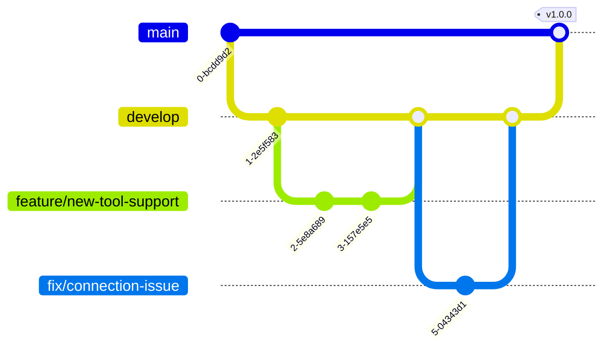
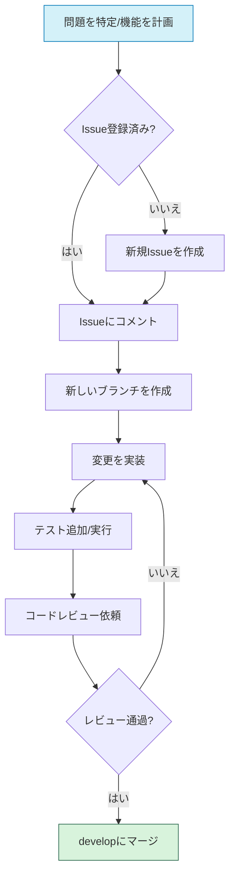

# コントリビューションガイド

Ollama MCP Client & Agent プロジェクトへの貢献に興味をお持ちいただき、ありがとうございます。このドキュメントでは、効率的に貢献するためのガイドラインを提供します。

## コード規約

### 命名規則

- **クラス名**: `PascalCase` (例: `MCPClient`, `ToolExecutor`)
- **変数・関数名**: `snake_case` (例: `connect_to_server`, `tool_result`)
- **定数**: `UPPER_SNAKE_CASE` (例: `MAX_RETRY_COUNT`, `DEFAULT_TIMEOUT`)
- **プライベートメンバー**: アンダースコア接頭辞 (例: `_internal_state`, `_process_response`)
- **タイプヒント**: すべての関数とメソッドにタイプヒントを付ける

### コードスタイル

このプロジェクトでは、以下のスタイルガイドラインに従ってください：

- [PEP 8](https://peps.python.org/pep-0008/) - Pythonコードスタイルガイド
- [PEP 484](https://peps.python.org/pep-0484/) - タイプヒントに関するガイドライン
- [Black](https://black.readthedocs.io/) - コードフォーマッタ
- [isort](https://pycqa.github.io/isort/) - インポート順序の整理

コードをコミットする前に、次のコマンドでフォーマットしてください：

```bash
# コードフォーマット
black ollama_mcp/ tests/ examples/

# インポート順序の整理
isort ollama_mcp/ tests/ examples/

# 静的型チェック
mypy ollama_mcp/
```

## ブランチ戦略

このプロジェクトでは、シンプルな GitFlow ベースのブランチ戦略を採用しています：



- **main**: 本番リリースブランチ（安定版）
- **develop**: 開発ブランチ（次のリリース準備）
- **feature/[名前]**: 新機能開発ブランチ
- **fix/[名前]**: バグ修正ブランチ
- **release/[バージョン]**: リリース準備ブランチ

## プルリクエストプロセス



### プルリクエスト作成手順

1. プロジェクトをフォークし、適切なブランチを作成します
2. コードを変更し、テストを追加または更新します
3. すべてのテストが通ることを確認します
4. 変更を適切なコミットメッセージとともにコミットします
5. プルリクエストを作成し、変更内容を詳細に説明します

### PRテンプレート

プルリクエストを作成する際は、次の情報を含めてください：

```
## 変更内容

[変更の簡潔な説明]

## 関連Issue

[関連するIssue番号（#123 など）]

## 変更の種類

- [ ] バグ修正
- [ ] 新機能
- [ ] 既存機能の変更
- [ ] コードスタイルの更新
- [ ] リファクタリング
- [ ] ドキュメントの更新
- [ ] その他（詳細を記載）

## チェックリスト

- [ ] テストを追加または更新しました
- [ ] ドキュメントを更新しました（必要な場合）
- [ ] コードスタイルガイドラインに従っています
- [ ] すべてのテストが通過します
- [ ] 自己レビューを行いました
```

## 開発ワークフロー

### 機能の追加

1. **計画**: 機能の要件と仕様を文書化します
2. **設計**: 必要なクラスとメソッドを設計します
3. **実装**: コードを作成し、適切なコメントを追加します
4. **テスト**: 単体テストと統合テストを作成します
5. **ドキュメント**: 関連ドキュメントを更新します
6. **レビュー**: コードレビューを依頼します

### バグ修正

1. **再現**: バグを再現するテストケースを作成します
2. **特定**: 問題の根本原因を特定します
3. **修正**: 最小限の変更でバグを修正します
4. **検証**: テストでバグが修正されたことを確認します
5. **ドキュメント**: 必要に応じてドキュメントを更新します

## コミットメッセージの規約

コミットメッセージには、次のフォーマットを使用してください：

```
[種類]: 簡潔な説明（50文字以内）

詳細な説明（必要な場合）。72文字で改行。
- 箇条書きで変更点を列挙することもできます
- 複数行に渡る場合は箇条書きが有効です

関連Issue: #123
```

種類の例：
- **feat**: 新機能
- **fix**: バグ修正
- **docs**: ドキュメントのみの変更
- **style**: コードの意味に影響しない変更（フォーマット等）
- **refactor**: バグ修正でも機能追加でもないコード変更
- **test**: テスト追加・修正
- **chore**: ビルドプロセスやドキュメント生成の変更

## コミュニケーション

質問や議論は以下の場所で行えます：

- Issueトラッカー: 機能要望やバグ報告
- Discussions: 一般的な質問や議論
- Pull Requests: コードレビューと具体的な変更の議論