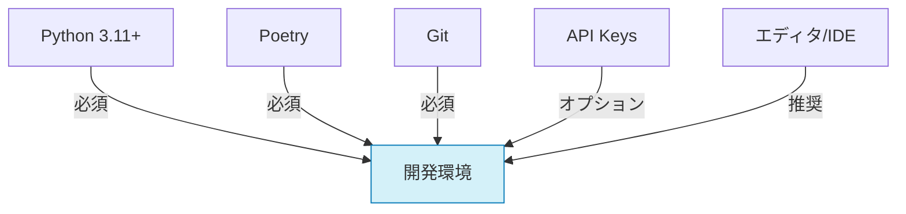
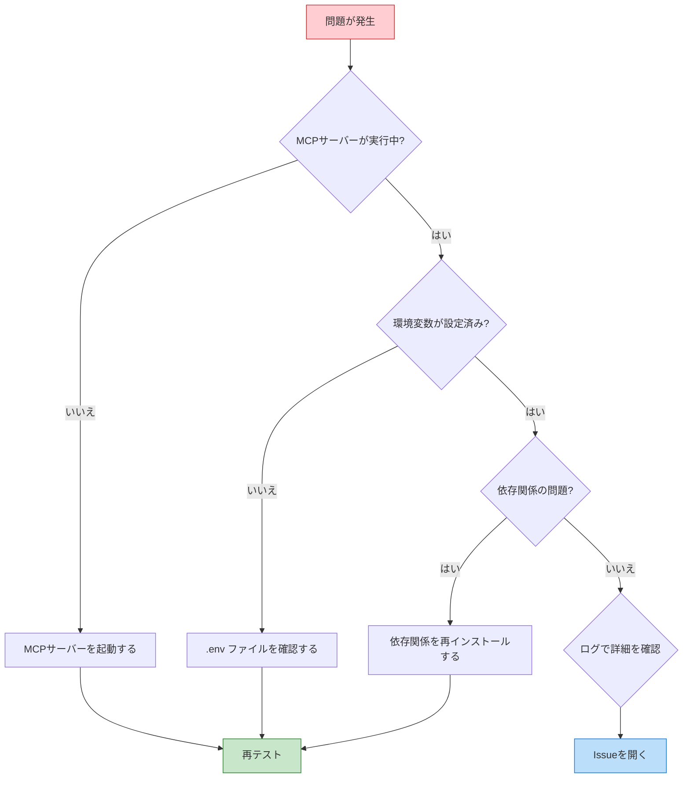

# 開発環境のセットアップ

このドキュメントでは、Ollama MCP Client & Agent の開発環境をセットアップする手順を説明します。

## 前提条件

開発を始める前に、以下のソフトウェアがインストールされていることを確認してください：

- Python 3.11以上
- Poetry（Python依存関係マネージャ）
- Git
- 必要に応じて：
  - OpenAI API キー（OpenAIモデルを使用する場合）
  - その他のAIモデルプロバイダーのAPI キー



## 環境セットアップ手順

### 1. リポジトリのクローン

```bash
git clone https://github.com/yourusername/ollama-mcp-client.git
cd ollama-mcp-client
```

### 2. 開発用仮想環境の作成

```bash
# poetryをインストール（まだの場合）
curl -sSL https://install.python-poetry.org | python3 -

# 開発用依存関係を含むすべての依存関係をインストール
poetry install --with dev

# Agnoと関連パッケージをインストール
poetry add agno mcp gradio loguru

# 仮想環境を有効化
poetry shell
```

### 3. 環境変数の設定

`.env`ファイルを作成し、必要な環境変数を設定します：

```bash
# .envファイルを作成
touch .env

# 以下の内容を追加
AGNO_TELEMETRY=false  # テレメトリを無効化する場合
OPENAI_API_KEY=your_key_here  # OpenAIモデルを使用する場合
# その他のAPI キー
```

### 4. 開発用サーバーのセットアップ

テスト用MCPサーバーをセットアップします：

```bash
# 例：サンプルサーバーをクローン
git clone https://github.com/example/mcp-server-example.git
cd mcp-server-example

# 依存関係をインストール
poetry install
```

### 5. プレコミットフックの設定

コードの品質を保つために、プレコミットフックを設定します：

```bash
# プレコミットをインストール
poetry add --group dev pre-commit

# プレコミットフックを設定
pre-commit install
```

## 開発用フォルダ構成

プロジェクトのフォルダ構成は以下の通りです：

```
ollama_mcp/
├── __init__.py
├── agno_integration.py      # Agno統合モジュール
├── agno_multimodal.py      # マルチモーダル機能
├── debug.py                # デバッグモジュール
├── tools/                  # ツール定義と実行
│   ├── __init__.py
│   ├── base.py
│   ├── registry.py
│   └── builtin.py
├── models/                 # モデル管理
│   ├── __init__.py
│   ├── base.py
│   └── utils.py
├── memory/                 # メモリ管理
│   ├── __init__.py
│   ├── session.py
│   └── state.py
├── knowledge/             # 知識ベース
│   ├── __init__.py
│   ├── vector_store.py
│   └── document.py
├── ui/                    # Gradio UI
│   ├── __init__.py
│   ├── app.py
│   ├── components.py
│   └── pages/
└── utils/                 # ユーティリティ
    ├── __init__.py
    ├── async_utils.py
    └── json_utils.py
```

## 開発ワークフロー

### 1. 機能実装

1. 新しいブランチを作成：
   ```bash
   git checkout -b feature/new-feature-name
   ```

2. コードを実装し、テストを追加

3. フォーマットとリンターを実行：
   ```bash
   # コードフォーマット
   poetry run format
   
   # インポート順序の整理
   poetry run lint
   
   # 型チェック
   poetry run typecheck
   ```

4. テストを実行：
   ```bash
   # 全テスト実行
   poetry run test
   
   # カバレッジ付きでテスト実行
   poetry run pytest --cov=ollama_mcp
   ```

### 2. アプリケーションの実行

開発中にアプリケーションを実行するには：

```bash
# メインアプリケーションを実行
poetry run app

# または特定の例を実行
poetry run python examples/basic_agent.py
```

## デバッグ

### VSCode でのデバッグ

VSCode を使用している場合は、次の `.vscode/launch.json` 設定を使用できます：

```json
{
    "version": "0.2.0",
    "configurations": [
        {
            "name": "Run App",
            "type": "python",
            "request": "launch",
            "program": "${workspaceFolder}/app.py",
            "console": "integratedTerminal",
            "justMyCode": false,
            "env": {
                "PYTHONPATH": "${workspaceFolder}",
                "AGNO_TELEMETRY": "false"
            }
        },
        {
            "name": "Run Current File",
            "type": "python",
            "request": "launch",
            "program": "${file}",
            "console": "integratedTerminal",
            "justMyCode": false,
            "env": {
                "PYTHONPATH": "${workspaceFolder}",
                "AGNO_TELEMETRY": "false"
            }
        }
    ]
}
```

### トラブルシューティング

よくある問題と解決策：



#### MCPサーバーの問題

**症状**: `Connection refused` または `MCP server not responding` エラーが発生する

**解決策**:
1. サーバーが実行中か確認
2. サーバーのパスが正しいか確認
3. サーバーのログでエラーを確認

#### 依存関係の問題

**症状**: `ImportError` または `ModuleNotFoundError` が発生する

**解決策**:
```bash
# 仮想環境が有効化されているか確認
# 依存関係を再インストール
poetry install

# Agnoと関連パッケージを再インストール
poetry add agno mcp gradio loguru
```

#### Agno関連の問題

**症状**: Agnoエージェントの初期化や実行でエラーが発生する

**解決策**:
1. 環境変数の確認：
   ```bash
   # .envファイルの内容を確認
   cat .env
   
   # 必要な環境変数が設定されているか確認
   echo $AGNO_TELEMETRY
   echo $OPENAI_API_KEY
   ```

2. Agnoのバージョン確認：
   ```bash
   # インストールされているバージョンを確認
   poetry show agno
   
   # 最新バージョンにアップデート
   poetry update agno
   ```

## 参考リンク

- [Agno公式ドキュメント](https://docs.agno.com)
- [MCPプロトコル仕様](https://mcp-protocol.org)
- [Gradioドキュメント](https://gradio.app/docs)

質問がある場合は、Issueトラッカーで質問するか、メインリポジトリのDiscussionsセクションを利用してください。