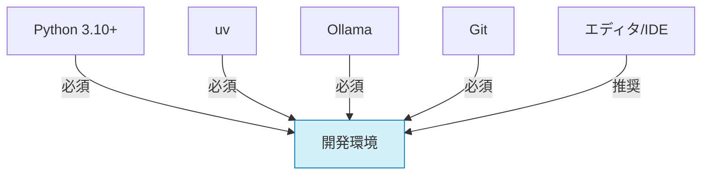
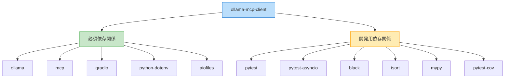

# 開発環境のセットアップ

このドキュメントでは、Ollama MCP Client & Agent の開発環境をセットアップする手順を説明します。

## 前提条件

開発を始める前に、以下のソフトウェアがインストールされていることを確認してください：

- Python 3.10以上
- uv（Python依存関係マネージャ）
- Ollama
- Git



## 環境セットアップ手順

### 1. リポジトリのクローン

```bash
git clone https://github.com/yourusername/ollama-mcp-client.git
cd ollama-mcp-client
```

### 2. 開発用仮想環境の作成

```bash
# uv を使用して仮想環境を作成
uv venv

# 仮想環境を有効化（Unix/MacOS）
source .venv/bin/activate

# 仮想環境を有効化（Windows）
.venv\Scripts\activate
```

### 3. 開発用依存関係のインストール

```bash
# 開発用依存関係を含むすべての依存関係をインストール
uv pip install -e ".[dev]"

# または requirements-dev.txt からインストール
uv pip install -r requirements-dev.txt
```

依存関係ツリー：



### 4. Ollamaのセットアップ

Ollamaをまだインストールしていない場合は、[Ollama公式サイト](https://ollama.com/download)からダウンロードしてインストールしてください。

必要なモデルをダウンロード：

```bash
# 基本モデルをプルする
ollama pull llama3
ollama pull mistral
```

### 5. 開発用サーバーのセットアップ

テスト用MCPサーバーをセットアップします：

```bash
# 例：サンプルサーバーをクローン
git clone https://github.com/example/mcp-server-example.git
cd mcp-server-example

# 依存関係をインストール
uv pip install -r requirements.txt
```

### 6. プレコミットフックの設定

コードの品質を保つために、プレコミットフックを設定します：

```bash
# プレコミットをインストール
uv pip install pre-commit

# プレコミットフックを設定
pre-commit install
```

## 開発用フォルダ構成

プロジェクトのフォルダ構成は以下の通りです：

```
ollama-mcp-client/
├── app.py                 # メインアプリケーションエントリーポイント
├── ollama_mcp/            # メインパッケージ
│   ├── __init__.py
│   ├── client.py          # MCPクライアント実装
│   ├── agent.py           # エージェントフレームワーク
│   ├── debug.py           # デバッグユーティリティ
│   ├── tools.py           # ツール定義と実行
│   ├── models.py          # モデル管理
│   └── ui/                # Gradio UI
│       ├── __init__.py
│       ├── app.py
│       ├── components.py
│       └── pages/
├── examples/              # 使用例
├── tests/                 # テストコード
├── docs/                  # ドキュメント
├── .pre-commit-config.yaml # プレコミット設定
├── pyproject.toml         # プロジェクト設定
├── requirements.txt       # 依存関係
└── requirements-dev.txt   # 開発用依存関係
```

## 開発ワークフロー

### 1. 機能実装

1. 新しいブランチを作成：
   ```bash
   git checkout -b feature/new-feature-name
   ```

2. コードを実装し、テストを追加

3. フォーマットとリンターを実行：
   ```bash
   # コードフォーマット
   black ollama_mcp/ tests/ examples/
   
   # インポート順序の整理
   isort ollama_mcp/ tests/ examples/
   
   # 型チェック
   mypy ollama_mcp/
   ```

4. テストを実行：
   ```bash
   # 全テスト実行
   pytest
   
   # カバレッジ付きでテスト実行
   pytest --cov=ollama_mcp
   ```

### 2. アプリケーションの実行

開発中にアプリケーションを実行するには：

```bash
# メインアプリケーションを実行
uv run app.py

# または特定の例を実行
uv run examples/basic_client.py
```

## デバッグ

### VSCode でのデバッグ

VSCode を使用している場合は、次の `.vscode/launch.json` 設定を使用できます：

```json
{
    "version": "0.2.0",
    "configurations": [
        {
            "name": "Run App",
            "type": "python",
            "request": "launch",
            "program": "${workspaceFolder}/app.py",
            "console": "integratedTerminal",
            "justMyCode": false,
            "env": {
                "PYTHONPATH": "${workspaceFolder}"
            }
        },
        {
            "name": "Run Current File",
            "type": "python",
            "request": "launch",
            "program": "${file}",
            "console": "integratedTerminal",
            "justMyCode": false,
            "env": {
                "PYTHONPATH": "${workspaceFolder}"
            }
        }
    ]
}
```

### トラブルシューティング

よくある問題と解決策：


#### Ollamaの問題

**症状**: `Failed to connect to Ollama server` エラーが発生する

**解決策**:
1. Ollamaが実行中か確認：
   ```bash
   # プロセスを確認
   ps aux | grep ollama
   
   # 必要に応じて起動
   ollama serve
   ```

2. Ollamaの動作を確認：
   ```bash
   # 簡単なモデル呼び出しでテスト
   ollama run llama3 "hello"
   ```

#### MCPサーバーの問題

**症状**: `Connection refused` または `MCP server not responding` エラーが発生する

**解決策**:
1. サーバーが実行中か確認
2. サーバーのパスが正しいか確認
3. サーバーのログでエラーを確認

#### 依存関係の問題

**症状**: `ImportError` または `ModuleNotFoundError` が発生する

**解決策**:
```bash
# 仮想環境が有効化されているか確認
# 依存関係を再インストール
uv pip install -e .
```

## 貢献の開始

これで開発環境のセットアップが完了しました。貢献を始める前に[CONTRIBUTING.md](CONTRIBUTING.md)を確認し、プロジェクトのコード規約とワークフローを理解してください。

質問がある場合は、Issueトラッカーで質問するか、メインリポジトリのDiscussionsセクションを利用してください。