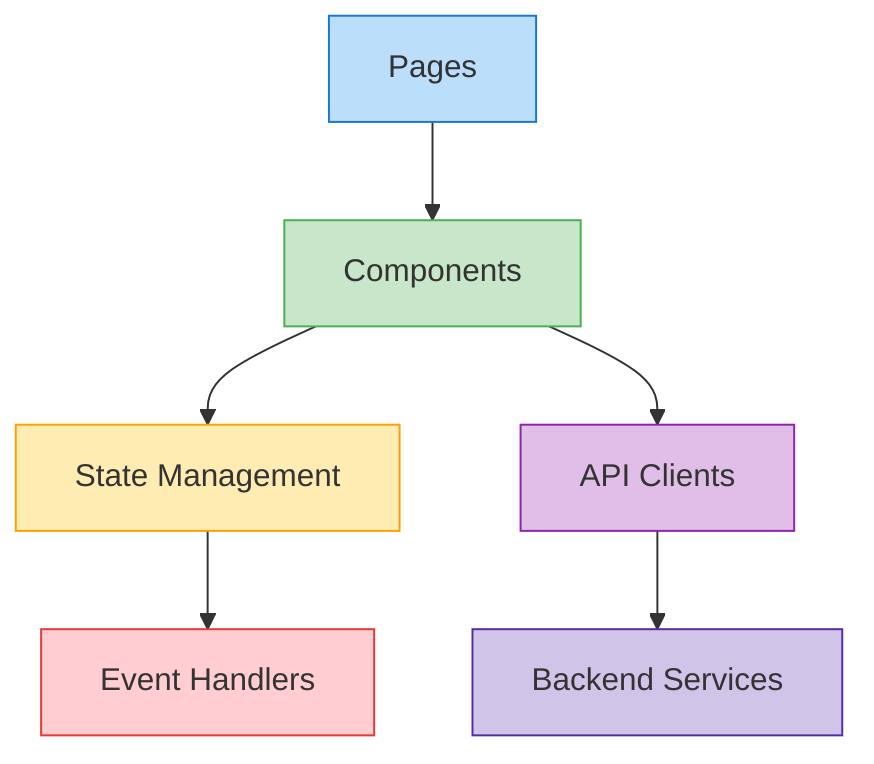
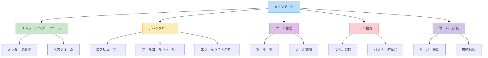

# フロントエンド開発ガイド

このドキュメントでは、Ollama MCP Client & Agent のフロントエンド（Gradio UI）開発に関するガイドラインを提供します。

## アーキテクチャ概要

フロントエンドは Gradio をベースにしており、以下のレイヤー構造に基づいて設計されています：



### レイヤーの責務

- **Pages**: ユーザーインターフェースの主要ページ
- **Components**: 再利用可能なUIコンポーネント
- **State Management**: アプリケーション状態の管理
- **API Clients**: バックエンドとの通信
- **Event Handlers**: ユーザーイベントの処理
- **Backend Services**: バックエンドサービスとの連携

## Gradio UI のコンポーネント構成

アプリケーションは以下の主要なコンポーネントで構成されています：



## 主要なデザインパターン

### 1. コンポーネントベースの設計

再利用可能なコンポーネントを作成して、UI全体を構成します：

```python
def create_chat_component(state):
    """チャットコンポーネントを作成する"""
    with gr.Column():
        chat_history = gr.Chatbot(label="チャット履歴")
        message_input = gr.Textbox(label="メッセージ", placeholder="メッセージを入力...")
        send_button = gr.Button("送信")
        
        # イベントハンドラ
        send_button.click(
            fn=handle_chat_message,
            inputs=[message_input, chat_history, state],
            outputs=[chat_history, message_input, state]
        )
        
    return chat_history, message_input, send_button
```

### 2. 状態管理

アプリケーションの状態を一元管理します：

```python
def initialize_state():
    """アプリケーション状態を初期化する"""
    return {
        "client": None,
        "connected": False,
        "server_info": None,
        "available_tools": [],
        "selected_model": "llama3",
        "model_params": {
            "temperature": 0.7,
            "top_p": 0.9
        },
        "debug_level": "info",
        "messages": []
    }

# 状態の更新関数
def update_state(state, updates):
    """状態を更新する"""
    new_state = state.copy()
    for key, value in updates.items():
        new_state[key] = value
    return new_state
```

### 3. イベント処理

ユーザーイベントを処理する関数を実装します：

```python
async def handle_chat_message(message, history, state):
    """チャットメッセージを処理する"""
    if not message.strip():
        return history, "", state
    
    # 状態の検証
    if not state["connected"]:
        history.append((message, "サーバーに接続されていません。まず接続してください。"))
        return history, "", state
    
    # メッセージを履歴に追加
    history.append((message, None))
    
    try:
        # クライアントを使用してメッセージを処理
        client = state["client"]
        response = await client.process_query(message)
        
        # 応答を履歴に追加
        history[-1] = (message, response)
        
        # メッセージを状態に保存
        messages = state["messages"].copy()
        messages.append({"role": "user", "content": message})
        messages.append({"role": "assistant", "content": response})
        
        new_state = update_state(state, {"messages": messages})
        return history, "", new_state
        
    except Exception as e:
        # エラー処理
        history[-1] = (message, f"エラーが発生しました: {str(e)}")
        return history, "", state
```

### 4. 非同期処理

フロントエンドでの非同期処理を適切に実装します：

```python
async def connect_to_server(server_path, state):
    """サーバーに接続する非同期関数"""
    try:
        # クライアントが既に存在する場合はクローズ
        if state["client"]:
            await state["client"].close()
        
        # 新しいクライアントを作成
        client = OllamaMCPClient(
            model_name=state["selected_model"],
            debug_level=state["debug_level"]
        )
        
        # サーバーに接続
        tools = await client.connect_to_server(server_path)
        
        # 状態を更新
        new_state = update_state(state, {
            "client": client,
            "connected": True,
            "server_info": {
                "path": server_path,
                "connected_at": time.time()
            },
            "available_tools": tools
        })
        
        return f"サーバー {server_path} に接続しました。利用可能なツール: {len(tools)}", new_state
        
    except Exception as e:
        return f"接続エラー: {str(e)}", state
```

## コード構成のガイドライン

### モジュール構成

フロントエンドコードは以下のように構成します：

```
ollama_mcp/ui/
├── __init__.py
├── app.py               # メインGradioアプリ
├── components/          # 再利用可能なコンポーネント
│   ├── __init__.py
│   ├── chat.py          # チャットコンポーネント
│   ├── debug.py         # デバッグコンポーネント
│   ├── tools.py         # ツール管理コンポーネント
│   └── settings.py      # 設定コンポーネント
├── pages/               # アプリページ
│   ├── __init__.py
│   ├── main_page.py     # メインページ
│   └── debug_page.py    # デバッグページ
├── state/               # 状態管理
│   ├── __init__.py
│   └── app_state.py     # アプリケーション状態
├── api/                 # APIクライアント
│   ├── __init__.py
│   └── client.py        # バックエンドクライアント
└── utils/               # ユーティリティ
    ├── __init__.py
    └── ui_utils.py      # UI関連のユーティリティ
```

### 命名規則

一貫した命名規則を使用することで、コードの可読性が向上します：

- **関数名**: `snake_case` (例: `create_chat_component`, `handle_message`)
- **コンポーネント変数**: `snake_case` (例: `chat_history`, `send_button`)
- **イベントハンドラ**: `handle_[イベント]` (例: `handle_click`, `handle_change`)
- **モジュール名**: `snake_case` (例: `chat.py`, `app_state.py`)

```python
# 命名規則の例
def create_debug_view(state):
    """デバッグビューを作成する"""
    with gr.Tab("デバッグ"):
        log_viewer = gr.JSON(label="ログ")
        refresh_button = gr.Button("更新")
        clear_button = gr.Button("クリア")
        
        # イベントハンドラ
        refresh_button.click(
            fn=handle_refresh_logs,
            inputs=[state],
            outputs=[log_viewer]
        )
        
        clear_button.click(
            fn=handle_clear_logs,
            inputs=[state],
            outputs=[log_viewer]
        )
    
    return log_viewer
```

## Gradio コンポーネントの使用

### 基本的なコンポーネント

Gradio の基本的なコンポーネントの使用例：

```python
def create_basic_components():
    """基本的なGradioコンポーネントを作成する"""
    with gr.Column():
        # テキスト入力
        text_input = gr.Textbox(
            label="テキスト入力",
            placeholder="ここにテキストを入力...",
            lines=3
        )
        
        # 数値入力
        number_input = gr.Number(
            label="数値入力",
            value=0.7,
            minimum=0,
            maximum=1,
            step=0.1
        )
        
        # チェックボックス
        checkbox = gr.Checkbox(
            label="有効化",
            value=True
        )
        
        # ラジオボタン
        radio = gr.Radio(
            choices=["オプション1", "オプション2", "オプション3"],
            label="選択",
            value="オプション1"
        )
        
        # ドロップダウン
        dropdown = gr.Dropdown(
            choices=["選択肢1", "選択肢2", "選択肢3"],
            label="選択してください",
            value="選択肢1"
        )
        
        # ボタン
        button = gr.Button("実行")
        
    return text_input, number_input, checkbox, radio, dropdown, button
```

### レイアウトコンポーネント

レイアウトの構成に使用するコンポーネント：

```python
def create_layout_example():
    """レイアウトコンポーネントの例"""
    with gr.Blocks() as demo:
        with gr.Row():
            with gr.Column(scale=1):
                gr.Markdown("## 左カラム")
                left_input = gr.Textbox(label="左入力")
            
            with gr.Column(scale=2):
                gr.Markdown("## 右カラム")
                right_input = gr.Textbox(label="右入力")
        
        with gr.Tabs():
            with gr.Tab("タブ1"):
                gr.Markdown("タブ1の内容")
                tab1_input = gr.Textbox(label="タブ1入力")
            
            with gr.Tab("タブ2"):
                gr.Markdown("タブ2の内容")
                tab2_input = gr.Textbox(label="タブ2入力")
        
        with gr.Accordion("詳細を表示", open=False):
            gr.Markdown("詳細な情報をここに表示します")
            detail_input = gr.Textbox(label="詳細入力")
    
    return demo
```

### インタラクティブなコンポーネント

ユーザーインタラクションを処理するコンポーネント：

```python
def create_interactive_components(state):
    """インタラクティブなコンポーネントの例"""
    with gr.Column():
        slider = gr.Slider(
            minimum=0, 
            maximum=1,
            value=state["model_params"]["temperature"],
            step=0.1,
            label="Temperature"
        )
        
        output = gr.Textbox(label="出力")
        
        button = gr.Button("適用")
        
        # スライダーの変更イベント
        slider.change(
            fn=lambda value: f"選択値: {value}",
            inputs=[slider],
            outputs=[output]
        )
        
        # ボタンのクリックイベント
        button.click(
            fn=handle_update_temperature,
            inputs=[slider, state],
            outputs=[state, output]
        )
    
    return slider, output, button

# イベントハンドラ
def handle_update_temperature(temperature, state):
    """温度パラメータを更新する"""
    model_params = state["model_params"].copy()
    model_params["temperature"] = temperature
    
    new_state = update_state(state, {"model_params": model_params})
    
    if state["client"]:
        state["client"].set_model_parameters(model_params)
    
    return new_state, f"Temperature を {temperature} に設定しました"
```

## チャットインターフェースの実装

エージェントとの対話に使用するチャットインターフェースの実装例：

```python
def create_chat_interface(state):
    """チャットインターフェースを作成する"""
    with gr.Column():
        # チャット履歴
        chat_history = gr.Chatbot(
            label="会話",
            height=500,
            show_copy_button=True
        )
        
        # 入力エリア
        with gr.Row():
            message_input = gr.Textbox(
                label="メッセージ",
                placeholder="メッセージを入力してください...",
                lines=2,
                show_label=False
            )
            send_button = gr.Button("送信")
        
        # クリアボタン
        clear_button = gr.Button("履歴をクリア")
        
        # イベントハンドラ
        send_handler = handle_chat_message
        
        send_button.click(
            fn=send_handler,
            inputs=[message_input, chat_history, state],
            outputs=[chat_history, message_input, state]
        )
        
        message_input.submit(
            fn=send_handler,
            inputs=[message_input, chat_history, state],
            outputs=[chat_history, message_input, state]
        )
        
        clear_button.click(
            fn=lambda: ([], ""),
            inputs=None,
            outputs=[chat_history, message_input]
        )
    
    return chat_history, message_input, send_button
```

## デバッグビューの実装

MCPデバッグ情報を表示するコンポーネントの実装例：

```python
def create_debug_view(state):
    """デバッグビューを作成する"""
    with gr.Column():
        gr.Markdown("## デバッグ情報")
        
        with gr.Tabs():
            with gr.Tab("ログ"):
                log_level = gr.Dropdown(
                    choices=["debug", "info", "warning", "error"],
                    label="ログレベル",
                    value=state["debug_level"]
                )
                
                logs_output = gr.JSON(
                    label="ログ出力",
                    value=[]
                )
                
                refresh_logs_button = gr.Button("更新")
                
                # イベントハンドラ
                log_level.change(
                    fn=handle_change_log_level,
                    inputs=[log_level, state],
                    outputs=[state]
                )
                
                refresh_logs_button.click(
                    fn=handle_refresh_logs,
                    inputs=[state],
                    outputs=[logs_output]
                )
            
            with gr.Tab("ツールコール"):
                tool_calls_output = gr.DataFrame(
                    headers=["時刻", "ツール名", "引数", "結果", "実行時間"],
                    label="ツールコール履歴"
                )
                
                refresh_tool_calls_button = gr.Button("更新")
                
                # イベントハンドラ
                refresh_tool_calls_button.click(
                    fn=handle_refresh_tool_calls,
                    inputs=[state],
                    outputs=[tool_calls_output]
                )
            
            with gr.Tab("エラー"):
                errors_output = gr.JSON(
                    label="エラー履歴",
                    value=[]
                )
                
                refresh_errors_button = gr.Button("更新")
                
                # イベントハンドラ
                refresh_errors_button.click(
                    fn=handle_refresh_errors,
                    inputs=[state],
                    outputs=[errors_output]
                )
    
    return log_level, logs_output, tool_calls_output, errors_output
```

## ツール管理インターフェースの実装

利用可能なツールを管理するインターフェースの実装例：

```python
def create_tools_interface(state):
    """ツール管理インターフェースを作成する"""
    with gr.Column():
        gr.Markdown("## ツール管理")
        
        # ツール一覧
        tools_table = gr.DataFrame(
            headers=["名前", "説明", "スキーマ"],
            label="利用可能なツール"
        )
        
        # ツール詳細
        with gr.Row():
            tool_selector = gr.Dropdown(
                label="ツールを選択",
                choices=[],
                interactive=True
            )
            
            refresh_tools_button = gr.Button("更新")
        
        tool_details = gr.JSON(
            label="ツール詳細"
        )
        
        # イベントハンドラ
        refresh_tools_button.click(
            fn=handle_refresh_tools,
            inputs=[state],
            outputs=[tools_table, tool_selector]
        )
        
        tool_selector.change(
            fn=handle_select_tool,
            inputs=[tool_selector, state],
            outputs=[tool_details]
        )
    
    return tools_table, tool_selector, tool_details
```

## サーバー接続インターフェースの実装

MCPサーバーへの接続を管理するインターフェースの実装例：

```python
def create_server_connection_interface(state):
    """サーバー接続インターフェースを作成する"""
    with gr.Column():
        gr.Markdown("## サーバー接続")
        
        with gr.Row():
            server_path = gr.Textbox(
                label="サーバーパス",
                placeholder="例: /path/to/server.py",
                value=""
            )
            
            connect_button = gr.Button("接続")
            disconnect_button = gr.Button("切断")
        
        connection_status = gr.Markdown("未接続")
        
        server_info = gr.JSON(
            label="サーバー情報",
            value=None
        )
        
        # イベントハンドラ
        connect_button.click(
            fn=handle_connect_to_server,
            inputs=[server_path, state],
            outputs=[connection_status, state, server_info]
        )
        
        disconnect_button.click(
            fn=handle_disconnect_from_server,
            inputs=[state],
            outputs=[connection_status, state, server_info]
        )
    
    return server_path, connection_status, server_info
```

## モデル設定インターフェースの実装

Ollamaモデルの設定インターフェースの実装例：

```python
def create_model_settings_interface(state):
    """モデル設定インターフェースを作成する"""
    with gr.Column():
        gr.Markdown("## モデル設定")
        
        with gr.Row():
            model_selector = gr.Dropdown(
                label="モデル",
                choices=["llama3", "mistral", "phi", "gemma"],
                value=state["selected_model"]
            )
            
            update_model_button = gr.Button("モデルを更新")
        
        with gr.Column():
            gr.Markdown("### パラメータ")
            
            temperature = gr.Slider(
                minimum=0,
                maximum=1,
                value=state["model_params"].get("temperature", 0.7),
                step=0.1,
                label="Temperature"
            )
            
            top_p = gr.Slider(
                minimum=0,
                maximum=1,
                value=state["model_params"].get("top_p", 0.9),
                step=0.1,
                label="Top P"
            )
            
            max_tokens = gr.Slider(
                minimum=10,
                maximum=4096,
                value=state["model_params"].get("max_tokens", 2000),
                step=10,
                label="最大トークン数"
            )
            
            update_params_button = gr.Button("パラメータを更新")
        
        model_status = gr.Markdown("")
        
        # イベントハンドラ
        update_model_button.click(
            fn=handle_update_model,
            inputs=[model_selector, state],
            outputs=[state, model_status]
        )
        
        update_params_button.click(
            fn=handle_update_model_params,
            inputs=[temperature, top_p, max_tokens, state],
            outputs=[state, model_status]
        )
    
    return model_selector, temperature, top_p, max_tokens, model_status
```

## メインアプリケーションの構成

Gradioアプリケーション全体の構成例：

```python
def create_app():
    """メインGradioアプリケーションを作成する"""
    # 初期状態を作成
    initial_state = initialize_state()
    
    with gr.Blocks(title="Ollama MCP Client & Agent") as app:
        # 状態の作成
        state = gr.State(value=initial_state)
        
        # ヘッダー
        gr.Markdown("# Ollama MCP Client & Agent")
        
        # タブでUIを構成
        with gr.Tabs():
            with gr.Tab("チャット"):
                chat_history, message_input, _ = create_chat_interface(state)
            
            with gr.Tab("デバッグ"):
                _, logs_output, tool_calls_output, _ = create_debug_view(state)
            
            with gr.Tab("ツール"):
                tools_table, _, _ = create_tools_interface(state)
            
            with gr.Tab("設定"):
                with gr.Row():
                    with gr.Column():
                        _, connection_status, _ = create_server_connection_interface(state)
                    
                    with gr.Column():
                        _, _, _, _, _ = create_model_settings_interface(state)
        
        # 一定間隔でのUI更新
        refresh_interval = 5
        
        def setup_periodic_refresh():
            """定期的な更新を設定"""
            # ログの自動更新
            logs_output.every(refresh_interval, handle_refresh_logs, inputs=[state], outputs=[logs_output])
            
            # ツールコールの自動更新
            tool_calls_output.every(refresh_interval, handle_refresh_tool_calls, inputs=[state], outputs=[tool_calls_output])
            
            # 接続状態の自動更新
            connection_status.every(refresh_interval, lambda s: get_connection_status(s), inputs=[state], outputs=[connection_status])
        
        # 定期更新の設定
        setup_periodic_refresh()
    
    return app
```

## イベントハンドラの実装例

UIイベントを処理するハンドラ関数の例：

```python
async def handle_connect_to_server(server_path, state):
    """サーバーへの接続を処理する"""
    if not server_path.strip():
        return "エラー: サーバーパスを入力してください", state, None
    
    try:
        # 接続処理を実行
        client = OllamaMCPClient(
            model_name=state["selected_model"],
            debug_level=state["debug_level"]
        )
        
        # サーバーに接続
        tools = await client.connect_to_server(server_path)
        
        # 状態を更新
        server_info = {
            "path": server_path,
            "connected_at": time.time(),
            "tools_count": len(tools)
        }
        
        new_state = update_state(state, {
            "client": client,
            "connected": True,
            "server_info": server_info,
            "available_tools": tools
        })
        
        return f"✅ 接続成功: {server_path}", new_state, server_info
        
    except Exception as e:
        return f"❌ 接続エラー: {str(e)}", state, None

def handle_refresh_logs(state):
    """ログの更新を処理する"""
    client = state.get("client")
    if not client or not client.debug_logger:
        return []
    
    # 最新のログを取得
    logs = client.debug_logger.get_recent_logs(count=50)
    return logs

def handle_select_tool(tool_name, state):
    """ツール選択を処理する"""
    if not tool_name or not state["available_tools"]:
        return None
    
    # 選択されたツールを検索
    for tool in state["available_tools"]:
        if tool["name"] == tool_name:
            return tool
    
    return None
```

## UI ユーティリティ関数

UIの構築と操作を支援するユーティリティ関数：

```python
def format_timestamp(timestamp):
    """タイムスタンプを読みやすい形式にフォーマットする"""
    if not timestamp:
        return ""
    
    dt = datetime.fromtimestamp(timestamp)
    return dt.strftime("%Y-%m-%d %H:%M:%S")

def get_connection_status(state):
    """接続状態のテキストを取得する"""
    if not state["connected"] or not state["client"]:
        return "🔴 未接続"
    
    server_info = state["server_info"]
    if not server_info:
        return "🟡 接続状態不明"
    
    connected_at = server_info.get("connected_at")
    if connected_at:
        time_str = format_timestamp(connected_at)
        return f"🟢 接続中: {server_info['path']} (接続時刻: {time_str})"
    
    return f"🟢 接続中: {server_info['path']}"

def create_tool_display_dict(tool):
    """ツール情報を表示用の辞書に変換する"""
    return {
        "名前": tool["name"],
        "説明": tool["description"],
        "スキーマ": json.dumps(tool["inputSchema"], indent=2, ensure_ascii=False)
    }
```

## スタイルとカスタマイズ

Gradio UIのスタイルをカスタマイズする例：

```python
def create_styled_app():
    """スタイル付きのアプリケーションを作成する"""
    with gr.Blocks(
        title="Ollama MCP Client & Agent",
        theme=gr.themes.Soft(),
        css="""
            .container { max-width: 1200px; margin: auto; }
            .header { text-align: center; margin-bottom: 20px; }
            .footer { margin-top: 20px; text-align: center; font-size: 0.8em; }
            .status-connected { color: green; font-weight: bold; }
            .status-disconnected { color: red; font-weight: bold; }
            .tool-item { margin-bottom: 10px; border-bottom: 1px solid #eee; padding-bottom: 10px; }
            .error-message { color: red; font-weight: bold; padding: 10px; background-color: #ffeeee; border-radius: 5px; }
        """
    ) as app:
        # アプリケーションの内容
        # ...
        
        # フッター
        with gr.Row(elem_classes=["footer"]):
            gr.Markdown("Ollama MCP Client & Agent © 2025")
    
    return app
```

## 実装例：デバッグビジュアライザー

MCPデバッグ情報を視覚化するコンポーネントの実装例：

```python
def create_debug_visualizer(state):
    """デバッグ情報の視覚化コンポーネントを作成する"""
    with gr.Column():
        gr.Markdown("## デバッグビジュアライザー")
        
        with gr.Tabs():
            with gr.Tab("通信フロー"):
                # 通信フローの可視化
                flow_output = gr.Plot(label="通信フロー")
                refresh_flow_button = gr.Button("更新")
                
                refresh_flow_button.click(
                    fn=generate_communication_flow_plot,
                    inputs=[state],
                    outputs=[flow_output]
                )
            
            with gr.Tab("ツールコール統計"):
                # ツールコール統計の可視化
                stats_output = gr.Plot(label="ツールコール統計")
                refresh_stats_button = gr.Button("更新")
                
                refresh_stats_button.click(
                    fn=generate_tool_call_stats_plot,
                    inputs=[state],
                    outputs=[stats_output]
                )
            
            with gr.Tab("エラー分析"):
                # エラー分析の可視化
                error_output = gr.Plot(label="エラー分析")
                refresh_error_button = gr.Button("更新")
                
                refresh_error_button.click(
                    fn=generate_error_analysis_plot,
                    inputs=[state],
                    outputs=[error_output]
                )
    
    return flow_output, stats_output, error_output

def generate_communication_flow_plot(state):
    """通信フローのプロットを生成する"""
    if not state["client"] or not state["client"].debug_logger:
        return None
    
    # ログからデータを抽出
    logs = state["client"].debug_logger.get_recent_logs(count=100)
    
    # matplotlib を使用してプロットを生成
    import matplotlib.pyplot as plt
    import numpy as np
    import io
    
    plt.figure(figsize=(10, 6))
    
    # 通信メッセージをプロット
    times = []
    directions = []
    
    for log in logs:
        if "event" in log and log["event"] in ["send_message", "receive_message"]:
            times.append(log["timestamp"])
            directions.append(1 if log["event"] == "send_message" else -1)
    
    plt.scatter(times, directions, c=["blue" if d > 0 else "green" for d in directions])
    plt.yticks([-1, 1], ["受信", "送信"])
    plt.xlabel("時間")
    plt.title("通信フロー")
    plt.grid(True, alpha=0.3)
    
    # プロットをメモリ内バッファに保存
    buf = io.BytesIO()
    plt.savefig(buf, format="png")
    buf.seek(0)
    
    # Gradio用にプロットを返す
    return plt
```

## パフォーマンスの最適化

Gradioアプリケーションのパフォーマンスを最適化するテクニック：

1. **インクリメンタルアップデート**: 一度に全てのコンポーネントを更新せず、必要なものだけ更新

```python
def optimize_refresh_strategy():
    """リフレッシュ戦略を最適化する"""
    # ログは高頻度で更新
    logs_output.every(3, handle_refresh_logs, inputs=[state], outputs=[logs_output])
    
    # ツールコールは中頻度で更新
    tool_calls_output.every(5, handle_refresh_tool_calls, inputs=[state], outputs=[tool_calls_output])
    
    # 接続状態は低頻度で更新
    connection_status.every(10, lambda s: get_connection_status(s), inputs=[state], outputs=[connection_status])
```

2. **レイジーローディング**: 必要になるまでコンポーネントをロードしない

```python
def create_lazy_loaded_components():
    """遅延ロードされるコンポーネントを作成する"""
    with gr.Blocks() as demo:
        load_button = gr.Button("高度な設定を読み込む")
        container = gr.Column(visible=False)
        
        with container:
            # 複雑なコンポーネント
            advanced_settings = create_advanced_settings()
        
        load_button.click(
            fn=lambda: True,
            inputs=None,
            outputs=[container],
            _js="() => true"  # JavaScript側での単純な処理
        )
```

3. **データ圧縮**: 大きなデータセットは表示前に圧縮または要約

```python
def compress_log_data(logs, max_entries=50):
    """ログデータを圧縮する"""
    if len(logs) <= max_entries:
        return logs
    
    # ログが多すぎる場合は最新のものを優先
    return logs[-max_entries:]
```

## アクセシビリティの考慮

アクセシビリティを向上させるためのベストプラクティス：

1. **ラベルの追加**: すべてのコンポーネントに明確なラベルを付加

```python
# 良い例
gr.Textbox(label="メッセージ", placeholder="メッセージを入力...")

# 悪い例
gr.Textbox(placeholder="入力...")
```

2. **キーボードナビゲーション**: キーボードでの操作をサポート

```python
def handle_key_events():
    """キーボードイベントを処理する"""
    message_input.blur(
        fn=None,
        inputs=None,
        outputs=None,
        _js="""() => {
            document.addEventListener('keydown', (e) => {
                if (e.key === 'Enter' && !e.shiftKey) {
                    // Enterキーで送信、Shift+Enterで改行
                    document.querySelector('button.send-button').click();
                    e.preventDefault();
                }
            });
        }"""
    )
```

3. **コントラスト比の確保**: テキストと背景のコントラスト比を十分に確保

```python
# スタイルでコントラスト比を確保
custom_css = """
    .important-text { color: #000000; background-color: #ffffff; }
    .error-message { color: #a50000; background-color: #fff8f8; }
"""
```

## テスト戦略

フロントエンドコンポーネントのテスト戦略：

1. **コンポーネントテスト**: 個々のコンポーネントの機能をテスト

```python
def test_chat_component():
    """チャットコンポーネントのテスト"""
    # テスト用の状態を作成
    test_state = initialize_state()
    
    # コンポーネントを作成
    chat_history, message_input, send_button = create_chat_component(test_state)
    
    # イベントをシミュレート
    test_message = "こんにちは"
    result = handle_chat_message(test_message, [], test_state)
    
    # 結果を検証
    assert len(result[0]) == 1
    assert result[0][0][0] == test_message
```

2. **エンドツーエンドテスト**: ユーザーフローのテスト

```python
def test_server_connection_flow():
    """サーバー接続フローのテスト"""
    app = create_app()
    
    # サーバーのモック
    mock_server = MockMCPServer()
    mock_server.start()
    
    # UIアクションのシミュレーション
    server_path_component = app.components[5]
    connect_button = app.components[6]
    
    server_path_component.value = mock_server.url
    result = connect_button.click()
    
    # 結果の検証
    assert "接続成功" in result[0]
    assert result[1]["connected"] == True
    
    # クリーンアップ
    mock_server.stop()
```

以上がGradioを使用したフロントエンド開発のガイドラインです。このガイドに従って、使いやすく機能的なUIを実装してください。質問がある場合は、開発チームに相談するか、プロジェクトのディスカッションフォーラムを利用してください。