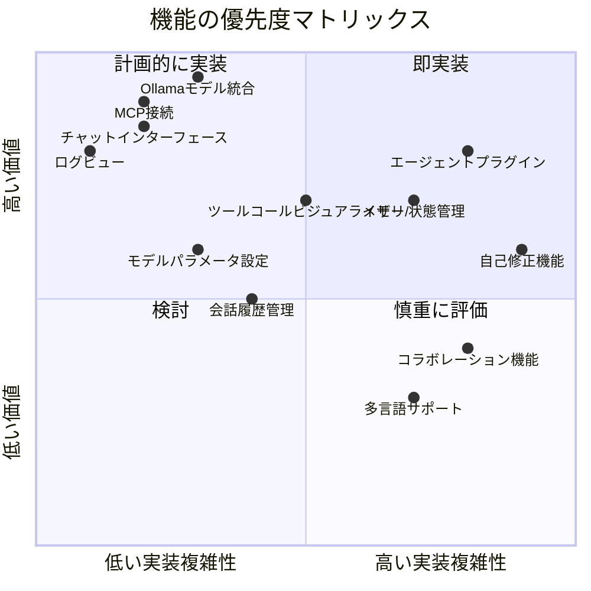
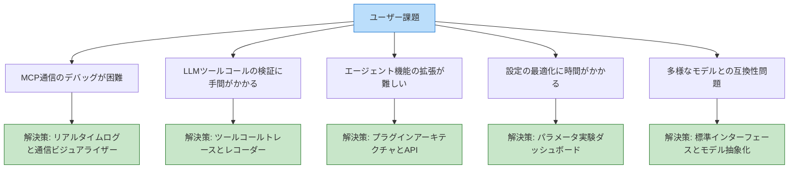
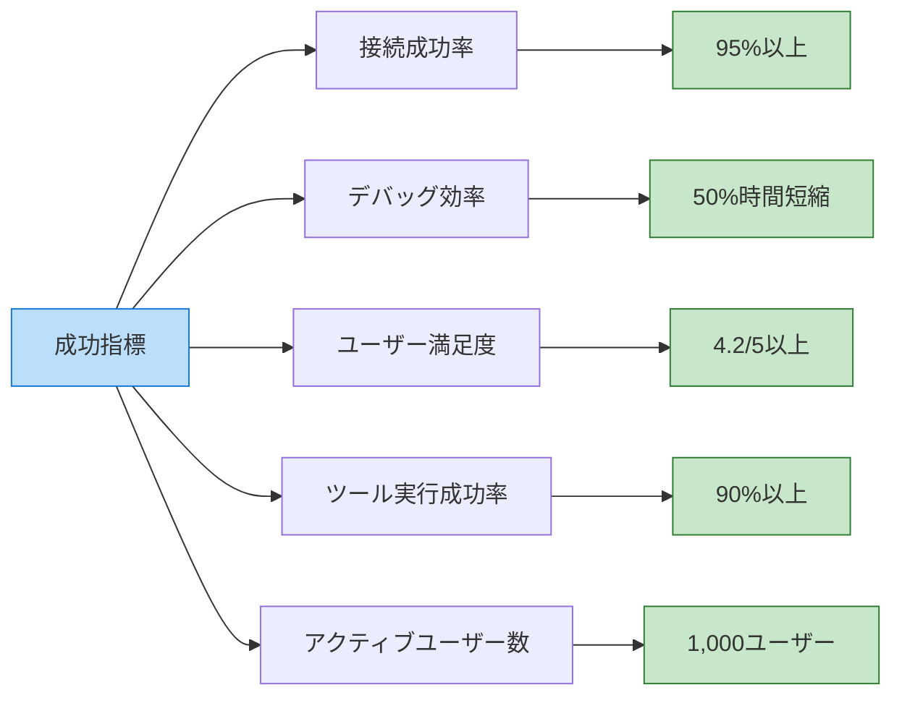
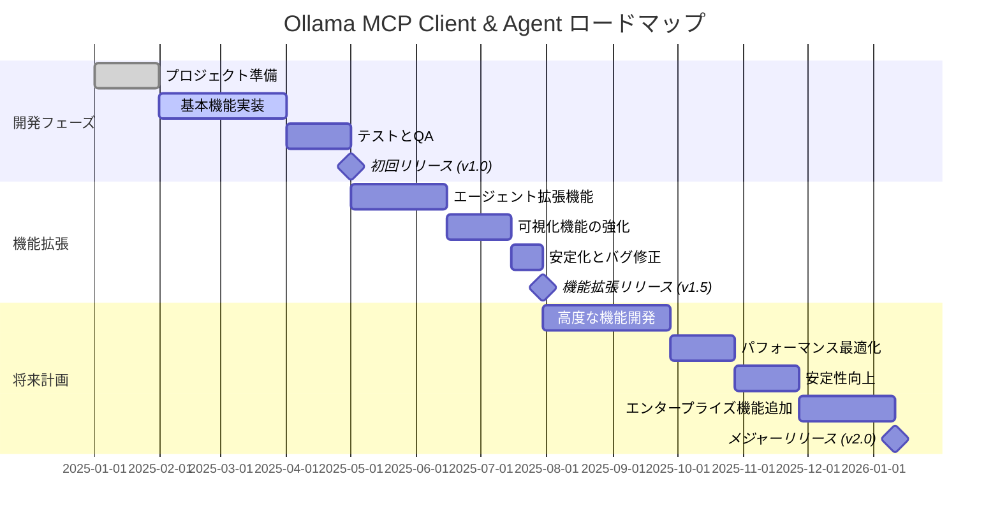

# 製品要件定義書 (PRD)

## 製品概要

**製品名**: Ollama MCP Client & Agent  
**バージョン**: 1.0.0  
**最終更新日**: 2025年3月22日

### 製品ビジョン

Ollama MCP Client & Agent は、Model Context Protocol (MCP) サーバーとシームレスに連携し、Ollama のローカル実行可能な大規模言語モデル (LLM) を活用して、高度なAIエージェント機能を提供するオープンソースツールです。開発者はMCPサーバーの動作をリアルタイムでデバッグし、AIエージェント機能を拡張できます。

### 主要目標

1. MCP サーバーとの連携を容易にし、問題のデバッグを効率化する
2. Ollama の LLM 機能を活用した拡張可能なエージェントフレームワークを提供する
3. 開発者と一般ユーザーの両方に使いやすいインターフェースを提供する
4. カスタムツールやプラグインを通じた機能拡張を可能にする
5. AIエージェント開発と実験のためのプラットフォームを確立する

## ターゲットユーザー

### ペルソナ

#### 1. 開発者アリス
- **ロール**: AIアプリケーション開発者
- **経験**: Pythonでの開発経験5年、AI/ML経験2年
- **目標**: MCP対応のアプリケーションを開発し、デバッグする
- **課題**: MCPプロトコルの理解と実装が難しい、調査にはデバッグツールが必要
- **期待**: 開発プロセスの簡素化、問題のすばやい特定と解決

#### 2. 研究者ボブ
- **ロール**: AIシステム研究者
- **経験**: 専門的な研究バックグラウンド、基本的なプログラミングスキル
- **目標**: 新しいエージェントアーキテクチャや手法の実験
- **課題**: 複雑なAIシステム構築に時間がかかる、技術的な障壁
- **期待**: 既存のMCPツールを活用した迅速なプロトタイピングと検証

#### 3. ビジネスユーザーキャロル
- **ロール**: 製品マネージャー
- **経験**: 非技術職だがAIに関心あり、基本的なITリテラシー
- **目標**: 特定のタスクを自動化するAIアシスタントの作成
- **課題**: 技術的な知識不足、高価なAPI使用料、長期実行アシスタントの構築
- **期待**: 技術的な詳細を理解せずにAIエージェントを構築・使用できる

## 解決すべき課題と価値提案

### 課題

1. **MCP実装の複雑さ**: Model Context Protocolの実装は複雑で、デバッグが困難
2. **プライベートなAIエージェント開発**: クラウドに依存しない、ローカルで安全なAIエージェント開発の必要性
3. **開発とデプロイの断絶**: AIエージェント開発と実際のデプロイ間のギャップ
4. **拡張の難しさ**: 既存のMCPクライアントは機能拡張が困難
5. **アクセシビリティの欠如**: 技術的でない利用者向けのインターフェース不足

### 価値提案

1. **オールインワンソリューション**: MCP接続、デバッグ、エージェント拡張を1つのアプリケーションで提供
2. **可視化と診断**: リアルタイムデバッグとMCP通信の可視化
3. **ローカルプライバシー**: すべての処理をローカルで実行、機密データの保護
4. **拡張性**: プラグインアーキテクチャによる簡単な機能拡張
5. **アクセシビリティ**: 技術的知識レベルに関わらず利用可能なインターフェース

## 機能要件

### 必須機能 (Must Have)

#### MCP接続と管理
- **[MCP-1]** MCPサーバーへの接続と切断
- **[MCP-2]** 利用可能なツールの自動検出と登録
- **[MCP-3]** サーバー接続状態のリアルタイム監視
- **[MCP-4]** 設定可能な接続パラメータ

#### Ollamaモデル統合
- **[OLM-1]** 複数Ollamaモデルからの選択と切り替え
- **[OLM-2]** モデルパラメータのカスタマイズ（温度、トークン数など）
- **[OLM-3]** モデル応答の処理とフォーマット
- **[OLM-4]** モデル状態のモニタリング

#### デバッグ機能
- **[DBG-1]** 詳細なロギングとログレベル設定
- **[DBG-2]** MCP通信の検査と表示
- **[DBG-3]** ツールコールの記録と結果表示
- **[DBG-4]** エラーの診断と問題解決支援

#### ユーザーインターフェース
- **[UI-1]** チャットベースの会話インターフェース
- **[UI-2]** タブ構造のメイン画面（チャット、デバッグ、ツール、設定）
- **[UI-3]** サーバー接続と設定インターフェース
- **[UI-4]** レスポンシブなデザインとキーボードショートカット

### 重要機能 (Should Have)

#### エージェント拡張
- **[AGT-1]** タスク計画と実行フレームワーク
- **[AGT-2]** コンテキストと状態の管理
- **[AGT-3]** 基本的なプラグインシステム
- **[AGT-4]** ツール使用パターンの学習

#### データ管理
- **[DAT-1]** 会話履歴の保存と読み込み
- **[DAT-2]** ツール使用統計の記録
- **[DAT-3]** ユーザー設定プロファイル
- **[DAT-4]** ログと診断データのエクスポート

#### 可視化
- **[VIZ-1]** ツールコールのフロービジュアライザー
- **[VIZ-2]** エラーパターン分析グラフ
- **[VIZ-3]** パフォーマンス統計
- **[VIZ-4]** 会話構造の視覚化

### 追加機能 (Nice to Have)

#### 高度な機能
- **[ADV-1]** 自己修正機能（エラー発生時の自動リカバリー）
- **[ADV-2]** マルチエージェント協調フレームワーク
- **[ADV-3]** メタプロンプティング支援
- **[ADV-4]** ワークフロー自動化

#### ユーザー体験向上
- **[UX-1]** テーマとカスタマイズオプション
- **[UX-2]** 多言語サポート
- **[UX-3]** ツアーとウェルカムガイド
- **[UX-4]** ショートカットキーのカスタマイズ

#### コラボレーション
- **[CLB-1]** 会話のエクスポートと共有
- **[CLB-2]** テンプレートライブラリ
- **[CLB-3]** リモートMCPサーバーへの接続
- **[CLB-4]** チーム共有設定

### 対象外機能 (Won't Have - この版では)

- 独自のLLMトレーニング機能
- 完全なRAG（検索拡張生成）システム
- クラウドデプロイメント機能
- 有料サブスクリプション管理
- エンタープライズシングルサインオン

## 機能詳細と受け入れ基準

### [MCP-1] MCPサーバーへの接続と切断

**説明**:  
ユーザーが新規または既存のMCPサーバーに接続し、必要に応じて接続を切断できる機能。

**受け入れ基準**:
- ユーザーはサーバーのパスまたはURLを入力して接続できる
- 接続エラーは明確なメッセージで表示される
- 接続状態がリアルタイムで表示される
- 接続を切断しても、接続情報は保持される
- 再接続は手動と自動（オプション）の両方で実行可能

**UI要素**:
- サーバーパス入力フィールド
- 接続/切断ボタン
- 接続状態インジケーター
- エラーメッセージ表示エリア

### [OLM-1] 複数Ollamaモデルからの選択と切り替え

**説明**:  
利用可能なOllamaモデルの一覧表示と選択、実行中のモデル切り替え機能。

**受け入れ基準**:
- インストール済みのOllamaモデルを自動検出して一覧表示
- モデルを選択して切り替えられる
- 未インストールのモデルをダウンロードするオプション
- モデルの切り替えでセッションは継続される
- モデル情報（サイズ、言語など）が表示される

**UI要素**:
- モデル選択ドロップダウン
- モデル情報表示
- モデルダウンロードボタン
- 現在選択中のモデル表示

### [DBG-1] 詳細なロギングとログレベル設定

**説明**:  
さまざまな詳細レベルでのロギングを提供し、ログレベルを調整できる機能。

**受け入れ基準**:
- 複数のログレベル（INFO、DEBUG、TRACEなど）をサポート
- ログレベルをリアルタイムで変更可能
- ログを検索、フィルタリング、エクスポート可能
- タイムスタンプとコンテキスト情報を含む構造化ログ
- ログの自動ローテーションとクリーンアップ

**UI要素**:
- ログレベル選択
- ログビューア
- 検索/フィルター機能
- エクスポートボタン
- クリアボタン

### [UI-1] チャットベースの会話インターフェース

**説明**:  
ユーザーとAIエージェント間の会話を促進するチャットインターフェース。

**受け入れ基準**:
- メッセージの送信と受信をリアルタイム表示
- 長いレスポンスの途中経過を表示
- ツール使用を視覚的に表示
- メッセージ履歴のスクロールとナビゲーション
- メッセージのコピーと保存機能

**UI要素**:
- メッセージ入力フィールド
- 会話履歴表示エリア
- 送信ボタン
- ツール使用インジケーター
- メッセージアクションメニュー

### [AGT-1] タスク計画と実行フレームワーク

**説明**:  
複雑なタスクを小さなステップに分解し、計画と実行を管理するフレームワーク。

**受け入れ基準**:
- ユーザーの高レベルタスクを複数のサブタスクに分解
- サブタスクの実行と進捗を追跡
- 前のステップの結果を次のステップで利用
- 実行計画の修正と適応
- エラー時に計画を再評価

**UI要素**:
- タスク分解の視覚化
- 進捗表示
- タスク詳細表示
- 計画修正オプション

## 非機能要件

### 性能要件

- **応答時間**: ユーザー操作への応答は200ms以内
- **チャット応答**: モデルサイズに依存するが、通常のクエリで3秒以内にレスポンス開始
- **メモリ使用量**: 基本使用時は512MB以下、Ollamaモデルのメモリ要件は別途
- **起動時間**: アプリケーション起動から操作可能になるまで3秒以内
- **同時処理**: 複数のツールコールを並行して実行可能

### 安定性とリカバリー

- **クラッシュ耐性**: 予期しないエラーが発生しても、アプリケーション全体はクラッシュしない
- **自動リカバリー**: 接続エラーや一時的な障害から自動的に回復する
- **データ損失防止**: 未保存の会話データを定期的に自動保存
- **エラー報告**: 深刻なエラーの詳細なログとオプションのエラーレポート機能
- **セッション継続**: サーバー再接続時にセッションを維持

### セキュリティ

- **データプライバシー**: すべての処理をローカルで実行、データは明示的な許可なく外部に送信しない
- **入力検証**: すべてのユーザー入力とAPI応答を検証
- **権限管理**: ファイルシステムと外部リソースへのアクセスを最小限の権限で実行
- **安全なデフォルト設定**: すべてのデフォルト設定は安全な値を使用
- **依存関係監査**: 使用されるすべての依存関係を定期的に監査

### 互換性

- **OS互換性**: Windows 10/11、macOS 11以降、Ubuntu 20.04/22.04以降
- **Python**: Python 3.10以上をサポート
- **スクリーンサイズ**: 最小1280x720から4Kディスプレイまでサポート
- **Ollamaバージョン**: Ollama 0.1.14以上をサポート
- **MCPバージョン**: 標準MCPプロトコル仕様に準拠

### アクセシビリティ

- **キーボードナビゲーション**: すべての機能をキーボードでアクセス可能
- **スクリーンリーダー対応**: ARIA属性を使用し、スクリーンリーダーと互換性あり
- **コントラスト比**: WCAG 2.1 AAレベルのコントラスト比を確保
- **テキストサイズ**: テキストサイズの調整をサポート
- **フォーカス表示**: キーボードフォーカスを視覚的に明確に表示

## ユーザー課題と解決策

## 成功指標と評価方法

### 主要成功指標 (KPI)

1. **接続成功率**: MCPサーバーへの接続試行が成功する確率
   - 目標: 95%以上の接続成功率
   - 測定: 接続試行と成功のログ分析

2. **デバッグ効率**: 問題診断にかかる平均時間
   - 目標: 類似の環境と比較して50%の時間短縮
   - 測定: ユーザーテストと時間計測

3. **ユーザー満足度**: システム使用後のユーザー評価
   - 目標: 5段階評価で平均4.2以上
   - 測定: アプリ内フィードバックとユーザーサーベイ

4. **ツール実行成功率**: ツールコールが正常に実行される確率
   - 目標: 90%以上のツール実行成功率
   - 測定: ツール実行ログとエラー率の分析

5. **アクティブユーザー数**: 定期的に使用するユーザー数
   - 目標: リリース後6ヶ月で1,000アクティブユーザー
   - 測定: 匿名使用統計（オプトイン）

### 二次指標

1. **平均セッション時間**: ユーザーがアプリケーションを使用する平均時間
   - 目標: 1セッションあたり15分以上
   - 測定: セッション開始と終了のタイムスタンプ

2. **機能利用率**: 各機能の使用頻度
   - 目標: 主要機能の80%が定期的に使用される
   - 測定: 機能使用のイベントトラッキング

3. **エラー発生率**: セッションごとの平均エラー数
   - 目標: セッションあたり0.5未満のエラー
   - 測定: エラーログの集計

4. **モデル切り替え頻度**: ユーザーがモデルを切り替える頻度
   - 目標: アクティブユーザーの50%が複数モデルを使用
   - 測定: モデル選択イベントの追跡

## 製品ロードマップ

## 技術実装の考慮事項

### 技術スタック

- **フロントエンド**: Gradio (Python)
- **バックエンド**: Python 3.10+, asyncio
- **LLM統合**: Ollama API
- **MCP通信**: 標準MCPプロトコル実装
- **データベース**: SQLite (ローカルストレージ)
- **依存関係管理**: uv

### アーキテクチャ決定

1. **Gradioの選択理由**:
   - Python統合の容易さ
   - 迅速なUI開発と更新
   - 非同期処理のサポート
   - ML/AIアプリケーションとの相性の良さ

2. **Pythonの選択理由**:
   - MCPとOllamaの既存エコシステムとの互換性
   - 非同期プログラミングの優れたサポート
   - クロスプラットフォームの容易さ
   - データ処理とAI操作のための豊富なライブラリ

3. **SQLiteの選択理由**:
   - ローカルアプリケーションの適合性
   - セットアップの簡易さとポータビリティ
   - トランザクション処理と信頼性
   - Pythonとの容易な統合

4. **非同期アーキテクチャの採用理由**:
   - UIのレスポンシブ性の向上
   - 長時間実行操作の効率的な処理
   - ネットワーク通信の効率
   - メモリ使用量の最適化

### API設計の原則

1. **一貫性**: 類似の機能は同様のパターンで実装
2. **シンプルさ**: 複雑性を隠蔽し、シンプルなインターフェースを提供
3. **自己説明性**: API名と引数は目的が明確で理解しやすいもの
4. **堅牢性**: エラー処理とリカバリーの組み込み
5. **拡張性**: 将来の拡張を容易にする設計

### セキュリティ考慮事項

1. **データ保護**:
   - すべての機密データはローカルに保存
   - 設定ファイルとデータベースの適切な権限設定
   - メモリ上の機密データの安全な処理

2. **入力検証**:
   - すべてのユーザー入力とAPI入力の検証
   - サニタイズによるインジェクション攻撃の防止
   - 入力サイズと形式の制限

3. **リソースアクセス**:
   - 最小権限の原則に従ったファイルシステムアクセス
   - 実行権限の制限とサンドボックス化
   - 明示的なリソースのクリーンアップ

4. **依存関係のセキュリティ**:
   - 定期的な依存関係の監査とアップデート
   - 既知の脆弱性のチェック
   - 最小限の依存関係セット

## リスクと軽減策

| リスク | 重大度 | 確率 | 軽減策 |
|--------|-------|------|--------|
| MCPプロトコルの変更 | 高 | 中 | プロトコルバージョンの明示的なサポート、テスト用モックサーバー |
| Ollamaの互換性問題 | 高 | 低 | 特定のOllamaバージョンのサポートを明示、バージョン検出機能 |
| 性能低下 | 中 | 中 | パフォーマンスプロファイリング、リソース制限とキャッシュ |
| サードパーティ依存関係の問題 | 中 | 低 | 主要依存関係のベンダリング、代替実装の準備 |
| ユーザー受け入れの低さ | 高 | 低 | 早期ユーザーフィードバック、ユーザビリティテスト、段階的リリース |
| データ損失 | 高 | 低 | 自動バックアップ、トランザクション処理、堅牢なエラー処理 |
| リソース枯渇 | 中 | 中 | リソースモニタリング、グレースフルデグラデーション、自動クリーンアップ |

## まとめ

Ollama MCP Client & Agent は、MCPサーバーとの連携を簡素化し、Ollamaの強力なLLM機能を活用するためのプラットフォームを提供します。デバッグ機能と拡張可能なエージェントフレームワークにより、開発者と一般ユーザーの両方が、ローカルで安全かつ効率的にAIエージェントを構築・使用できるようになります。

段階的な開発アプローチにより、基本機能から高度な機能まで計画的に実装され、ユーザーフィードバックに基づいて継続的に改善されます。オープンソースの特性を活かし、コミュニティの貢献による機能拡張も期待されます。

本製品は、AI開発の民主化と、プライバシーを重視したローカルAIエージェントの普及に貢献することを目指します。